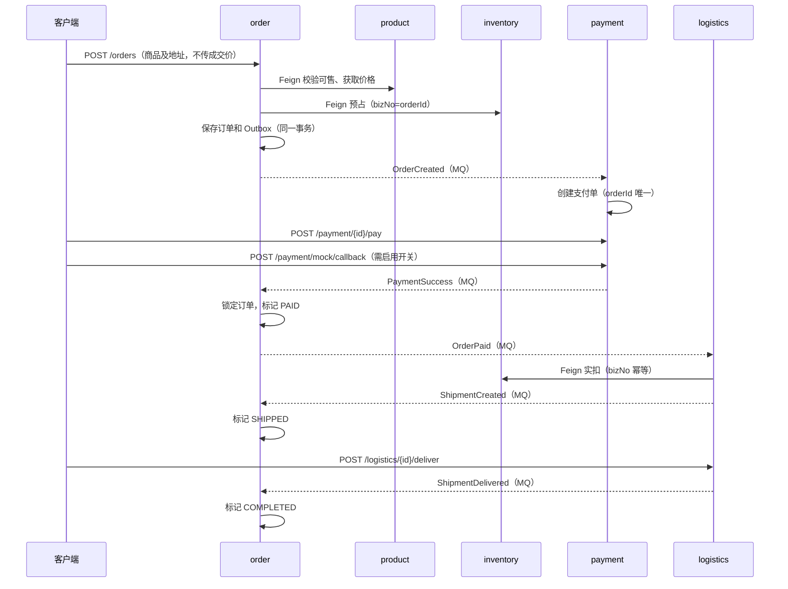

# springboot-ddd-project — DDD 风格购物平台学习项目

> 基于 Spring Boot 3.2 + JDK 21 的领域驱动设计 (DDD) 实战学习工程，模拟一个电商购物平台的完整业务链路。
> 每个业务子域都是独立的 Spring Boot 应用，通过 OpenFeign 同步调用 + RocketMQ 领域事件异步协作。

第一次接触 DDD，打开 [从零读懂 DDD：学习、使用与开发指南](docs/ddd-beginner-guide.md)，先完成一个不需要八服务的小实验，再按需读概念、开发和联调章节。

- 先获得第一次动手反馈：[运行订单测试，验证已付订单不能取消](docs/ddd-beginner-guide.md#11-先跑通一个不需要八服务的小实验)，不需要数据库或 MQ。
- 不理解为什么这样设计：看 [普通 Service 如何演变为有行为的模型](docs/ddd-beginner-guide.md#22-看懂贫血模型和有行为的模型)，再看 [商城分工比喻](docs/ddd-beginner-guide.md#24-把系统想成一家有分工的商城)。
- 不知道代码怎么跑起来：看 [启动装配、HTTP/MQ/定时入口和订单逐站流转](docs/ddd-beginner-guide.md#63-程序从哪里启动又是谁调用这些类)。
- 拿到需求不知道怎么写：照 [修改订单备注的十步教程](docs/ddd-beginner-guide.md#103-进阶练习只允许未支付订单修改备注) 操作，每步都有检查点；[参考实现验证](docs/ddd-beginner-guide.md#remark-reference) 在隔离副本运行，未合入当前业务源码。
- 检查是否能独立开发：完成 [取消原因新需求](docs/ddd-beginner-guide.md#124-独立练习不照抄完整答案)，先列规则、文件和测试，再看折叠提示。

配置与已有接口速查见 [运行与验收手册](docs/operations.md)。

## 目录

- [一、项目目标](#一项目目标)
- [二、服务划分](#二服务划分)
- [三、DDD 分层规范](#三ddd-分层规范)
- [四、核心概念速查](#四核心概念速查ddd-概念--本项目对照)
- [五、关键业务链路](#五关键业务链路)
- [六、快速开始](#六快速开始)
- [七、模块依赖关系](#七模块依赖关系)
- [八、鉴权方案](#八鉴权方案jwt-双-token--不使用-security-注解)
- [九、代码约定](#九代码约定)

---

## 一、项目目标

- **学习 DDD 战略设计**：如何划分限界上下文 (Bounded Context)、如何通过发布语言 (Published Language) 通信、如何做上下文映射 (Context Map)。
- **学习 DDD 战术设计**：聚合根 / 实体 / 值对象 / 领域服务 / 应用服务 / 仓储 / 领域事件 / 工厂 / 防腐层。
- **实战电商核心链路**：下单 → 支付 → 发货 → 签收 的完整事件驱动流程。
- **掌握 Spring Boot 3 + JDK 21**：record、sealed interface、pattern matching、虚拟线程等现代特性。

## 二、服务划分

| 端口 | 模块 | 限界上下文 | 职责 |
|---|---|---|---|
| — | `ddd-common` | 共享内核 | Money / Address / DomainEvent / Result / BusinessException |
| — | `ddd-api-contract` | 发布语言 | Feign Client 接口 + DTO + 跨上下文事件 |
| 8081 | `ddd-auth-service` | 认证鉴权 | 注册 / 登录 / 双 Token / 黑名单 |
| 8082 | `ddd-user-service` | 用户中心 | 用户资料 / 地址簿 / 会员等级 / RBAC |
| 8083 | `ddd-product-service` | 商品目录 | SPU / SKU / 类目 / 品牌 / 上下架 |
| 8084 | `ddd-inventory-service` | 库存仓库 | 仓库 / 预占 / 实扣 / 释放 / 流水 |
| 8085 | `ddd-order-service` | 订单 | 订单聚合根 / 状态机 / 事件 |
| 8086 | `ddd-payment-service` | 支付 | 支付单 / 退款单 / 渠道适配 |
| 8087 | `ddd-logistics-service` | 物流履约 | 发货单 / 运单 / 轨迹 / 签收 |
| 8088 | `ddd-cart-service` | 购物车 | 加购 / 结算预览 |

**服务拆分理由**：
- `auth` 与 `user` 拆分：认证是安全边界，用户中心是业务边界，变更频率与访问模式完全不同。
- `product` 与 `inventory` 拆分：商品是"卖什么"（读多写少、可缓存），库存是"还有多少"（写多、热点行、强一致），一致性要求差异极大。

## 三、DDD 分层规范

每个业务服务按以下四层组织，目录展示的是设计意图；消息 Listener 的技术耦合等现有取舍见 [指南第 5.5 节](docs/ddd-beginner-guide.md#55-学规范也要认识现有代码的取舍)：

```
ddd-xxx-service/
├── interfaces/       用户接口层 (Facade)：Controller / DTO / Assembler
├── application/      应用服务层：Command / Query / ApplicationService / Listener
├── domain/           领域层 (核心，禁止依赖 Spring/JPA)
│   ├── model/        aggregate (聚合根) / entity / valueobject / event
│   ├── service/      领域服务
│   ├── repository/   仓储接口 (依赖倒置)
│   ├── factory/      工厂
│   └── statemachine/ 状态机
└── infrastructure/   基础设施层
    ├── persistence/  po / dao / converter / repository impl
    ├── rpc/          OpenFeign Client 配置
    ├── mq/           RocketMQ Producer / Consumer
    ├── cache/        Redis
    └── config/       Security / JPA / Feign / Jackson 配置
```

**依赖方向（严格单向）**：
```
interfaces  →  application  →  domain  ←  infrastructure
```
- 领域层不依赖任何其他层，是纯粹的业务模型 (POJO)。
- 基础设施层"实现"领域层定义的接口（依赖倒置原则 DIP）。
- 接口层只依赖应用层，不直接接触领域层（可选，允许读操作直接访问）。

## 四、核心概念速查（DDD 概念 → 本项目对照）

| DDD 概念 | 说明 | 本项目示例 |
|---|---|---|
| **Entity 实体** | 有唯一标识、有生命周期、可修改 | `Order`, `Spu`, `User` |
| **Value Object 值对象** | 无标识、不可变、按值相等 | `Money`, `Address`, `Mobile` |
| **Aggregate 聚合** | 守护业务不变式的一致性边界 | `Order` 聚合包含 `OrderItem` |
| **Aggregate Root 聚合根** | 聚合的入口，守护不变式 | `Order`, `PaymentOrder`, `Shipment` |
| **Domain Service 领域服务** | 跨聚合的业务逻辑，不属于任何一个聚合 | `StockReservationService`, `OrderPricingService` |
| **Application Service 应用服务** | 编排用例、管理事务边界、发布事件 | [OrderApplicationService](ddd-order-service/src/main/java/com/example/ddd/order/application/service/OrderApplicationService.java) |
| **Repository 仓储** | 聚合的持久化抽象，接口在 domain 层 | `OrderRepository` (接口) / `OrderRepositoryImpl` |
| **Domain Event 领域事件** | 表达"已发生的业务事实"，用于跨聚合协作 | `OrderPaidEvent`, `StockLockedEvent` |
| **Factory 工厂** | 封装聚合创建与校验 | [Order.create](ddd-order-service/src/main/java/com/example/ddd/order/domain/model/aggregate/Order.java) 静态工厂 |
| **Anti-Corruption Layer 防腐层** | 隔离外部上下文的模型污染 | [ProductGateway](ddd-order-service/src/main/java/com/example/ddd/order/application/port/ProductGateway.java) 的 SKU 快照 |
| **Bounded Context 限界上下文** | 模型的有效边界 | 每个 ddd-xxx-service 就是一个上下文 |
| **Shared Kernel 共享内核** | 多个上下文共享的模型片段 | `ddd-common` 模块 |
| **Published Language 发布语言** | 上下文间通信的公共契约 | `ddd-api-contract` 模块 |

## 五、关键业务链路

### 下单 → 支付 → 发货 → 签收（事件驱动）



取消与退款：`OrderCancelled` 提交后由 order 消费者释放库存、payment 消费者关单；
取消与收款并发时 payment 补偿全额退款。`RefundSuccess` 推进订单到 REFUNDED，释放尚未实扣的预占。
物流通过查询支付退款状态阻止后续履约；已经发货的商品必须实际退货验收后才能入库。

以上描述业务主路径，不代表所有失败都会自动恢复。当前库存释放适配器会吞掉远程异常，可能导致消费完成标记与实际释放结果不一致；具体调用链和恢复能力边界见 [指南第 7.7 节](docs/ddd-beginner-guide.md#77-邮局比喻的边界当前实现仍有缺口)。

### 订单状态机

```text
CREATED ──支付──> PAID ──发货──> SHIPPED ──签收──> COMPLETED
   │               │               │                │
   └─取消─> CANCELLED              全额退款（均支持）
                   └───────────────┴────────────────┘
                                   ↓
                              REFUNDING → REFUNDED
```

订单支付、取消、发货等写操作持有订单行锁；迟到支付不会复活已取消订单，重复消息不重复发事件。

## 六、快速开始

### 构建与离线回归

在仓库根目录执行（JDK 21、Maven 3.9+）：

```bash
mvn -f springboot-ddd-project/pom.xml verify
```

这会递归构建两个共享模块与八个服务，运行 JUnit 5、Mockito、H2/Flyway/JPA 测试并打包。
依赖首次需要从 Maven 仓库解析，测试本身不需要启动 MySQL、Redis 或 RocketMQ。
不要仅用 `-pl springboot-ddd-project -am` 判断服务是否编译通过：该选择只包含父模块。

### 前置组件与启动顺序

```bash
# 在仓库根目录启动本地依赖；也可以使用自己已有的 MySQL/Redis/RocketMQ。
docker compose -f springboot-ddd-project/docker-compose.yml up -d
```

确认 MySQL 3306、Redis 6379、NameServer 9876 与 Broker 10911 可连接。
默认配置面向本地学习环境，不要暴露公网。Flyway 自动建表，示例 SKU 为 `2000` / `2001`，默认仓库为 `1`。
数据库为 `ddd_auth`、`ddd_user`、`ddd_product`、`ddd_inventory`、`ddd_order`、`ddd_payment`、`ddd_logistics`、`ddd_cart`。

构建后按以下顺序在**各自终端**启动（每条命令持续运行）：

```bash
java -jar springboot-ddd-project/ddd-user-service/target/ddd-user-service.jar
java -jar springboot-ddd-project/ddd-auth-service/target/ddd-auth-service.jar
java -jar springboot-ddd-project/ddd-product-service/target/ddd-product-service.jar
java -jar springboot-ddd-project/ddd-inventory-service/target/ddd-inventory-service.jar
java -jar springboot-ddd-project/ddd-order-service/target/ddd-order-service.jar
PAYMENT_MOCK_ENABLED=true java -jar springboot-ddd-project/ddd-payment-service/target/ddd-payment-service.jar
java -jar springboot-ddd-project/ddd-logistics-service/target/ddd-logistics-service.jar
java -jar springboot-ddd-project/ddd-cart-service/target/ddd-cart-service.jar
```

支付 Mock 回调默认关闭；只有本地联调才启用 `PAYMENT_MOCK_ENABLED=true`。
物流自动轨迹默认关闭，可设置 `LOGISTICS_MOCK_ENABLED=true`，每 30 秒推进一次；脚本默认直接调用签收接口。
无需额外 profile 即可本地启动；八服务均提供 `application-dev.yml` 和 `logback-spring.xml`，可设置 `SPRING_PROFILES_ACTIVE=dev` 启用统一 Feign 超时及低敏日志配置。连接、日志和 Feign URL 可通过 Spring 环境变量覆盖，详见 [运行与接口手册](docs/operations.md)。

### 端到端验证

需要 bash、curl、jq 和已启动的服务：

```bash
bash springboot-ddd-project/scripts/e2e.sh --check
bash springboot-ddd-project/scripts/e2e-2.sh  # 注册、建档、登录、刷新、注销
bash springboot-ddd-project/scripts/e2e-3.sh  # 商品与库存契约、预占/释放幂等
bash springboot-ddd-project/scripts/e2e-4.sh  # 下单、取消、库存恢复
bash springboot-ddd-project/scripts/e2e-5.sh  # 支付、发货、签收、全额退款
bash springboot-ddd-project/scripts/e2e.sh    # 完整链路，含购物车
```

脚本断言 HTTP 状态、`Result.code == "0000"` 及业务状态；异步步骤有超时轮询。
每次创建独立测试账号，阶段 5/6 会消耗一件库存并留下订单/退款流水；仅在独立测试环境串行运行。
失败时不会伪造成功、删除业务记录或自动重试写请求，可根据输出的 orderId 排查。
真实依赖未启动时 `--check` 会失败；H2 回归不能替代真实服务联调。

## 七、模块依赖关系

```
                    ddd-common (共享内核)
                         ▲
                         │
                  ddd-api-contract (发布语言)
                         ▲
                         │
    ┌──────────┬─────────┼─────────┬──────────┐
    │          │         │         │          │
auth-svc  user-svc  product-svc  order-svc  ... (8 个业务服务)
```

所有业务服务都依赖 `ddd-common` 和 `ddd-api-contract`，但服务之间**不直接依赖 jar**，只通过 HTTP (Feign) 和 MQ (RocketMQ) 通信，符合"限界上下文自治"原则。

## 八、鉴权方案（JWT 双 Token + 不使用 Security 注解）

### 双 Token 机制

| 类型 | 载体 | 有效期 | 存储 | 用途 |
|---|---|---|---|---|
| **AccessToken** | JWT (HS256) | 30 分钟 | 客户端 | 业务 API 认证 |
| **RefreshToken** | 不透明字符串 (UUID + HMAC) | 7 天 | Redis | 换发新 AccessToken |

**Redis Key 设计**：
- `auth:refresh:{userId}:{tokenId}` — RefreshToken 元数据，TTL = 7 天
- `auth:access:blacklist:{tokenId}` — AccessToken 黑名单，TTL = 剩余有效期
- `auth:user:perms:{userId}` — 权限集合缓存，TTL = 15 分钟
- `auth:login:fail:{username}` — 登录失败计数，5 次锁定 10 分钟

### 权限校验：不使用 `@PreAuthorize` / `@Secured` / `@RolesAllowed`

auth 上下文改用自定义注解 + AOP。下面是用法示意，不表示订单服务已经安装了该权限切面；订单、支付、物流和购物车通过 auth 校验 Token，运营权限和服务间认证边界见 [运行与接口手册](docs/operations.md#统一响应与认证)：

```java
@RequiresPermission("order:create")
@PostMapping
public Result<OrderDTO> placeOrder(@RequestBody PlaceOrderCommand cmd) {
    // ...
}
```

`PermissionAspect` 拦截所有带 `@RequiresPermission` / `@RequiresRole` 的方法，从 `SecurityContext` 取出当前用户的权限集合做匹配，不通过则抛 `BusinessException(AUTH_1003)`。

**为什么不用 Spring Security 的方法级注解？**
- 学习价值：手写 AOP 更能理解权限校验的本质。
- 灵活性：可以自定义表达式（例如 `@RequiresPermission(value = "order:read", logical = OR)`）。
- 解耦：领域层和应用层不直接依赖 Spring Security，方便未来切换鉴权框架。

## 九、代码约定

### 命名规范

| 类型 | 后缀 | 示例 |
|---|---|---|
| 聚合根 | 无 | `Order`, `User`, `Spu` |
| 实体 | 无 | `OrderItem`, `Address` |
| 值对象 | 无 | `Money`, `Mobile` |
| 领域服务 | `DomainService` 或业务名 | `OrderPricingService` |
| 应用服务 | `ApplicationService` | `OrderApplicationService` |
| 仓储接口 | `Repository` | `OrderRepository` |
| 仓储实现 | `RepositoryImpl` | `OrderRepositoryImpl` |
| PO | `PO` | `OrderPO`, `OrderItemPO` |
| DAO | `Dao` 或 `JpaRepository` | `OrderDao extends JpaRepository<OrderPO, String>` |
| 转换器 | `Converter` | `OrderConverter` |
| Controller | `Controller` | `OrderController` |
| Command | `Command` | `PlaceOrderCommand` |
| Query | `Query` | `OrderListQuery` |
| DTO | `DTO` | `OrderDTO` |
| Assembler | `Assembler` | `OrderAssembler` |
| 领域事件 | `Event` | `OrderPaidEvent` |

### 事务边界

- **应用服务方法** 是事务边界，标注 `@Transactional`。
- **领域层** 不感知事务，只负责业务规则。
- **事务不跨服务数据库**。一般以聚合为单位；跨仓库存操作和支付/全额退款在同一上下文内用本地事务维护必要不变式。
- 订单落库回滚时即时补偿远程预占；若进程崩溃或补偿 RPC 失败，仍需对账，Outbox 不能消除这个跨服务窗口。

### 领域事件发布

订单、支付、物流采用“收集 → 本地 Outbox → 后台投递”：
1. 聚合行为收集不可变领域事件。
2. 业务数据与 `t_event_outbox` 在同一事务保存；事件写入失败则回滚业务。
3. [EventOutbox](ddd-common/src/main/java/com/example/ddd/common/infrastructure/messaging/EventOutbox.java) 每秒读取已提交未发送事件，成功后标记，失败保留重试。
4. 允许重复投递，不承诺全局消息顺序；消费者依靠状态校验、重试及幂等最终收敛。

早期 auth/user/product/inventory 发布器仍为提交后直接发送，未全部迁移 Outbox，存在发送失败需人工对账的边界。

### 幂等设计

- **新链路消费者**：[EventInbox](ddd-common/src/main/java/com/example/ddd/common/infrastructure/messaging/EventInbox.java) 用 2 分钟 Redis 租约防并发，业务成功后才写 24 小时完成标记；失败或锁被占用均交给 Broker 重试。
- **数据库兜底**：支付单 orderId 唯一、退款单 paymentId 唯一、发货单 orderId 唯一，加行锁与领域状态幂等，不仅依赖 Redis TTL。
- **库存取消屏障**：`t_stock_operation` 按 bizNo 加锁；先释放后预占会被拒绝，已实扣后的释放不误动其他订单库存。热点库存仍使用 `@Version` 重试。
- **购物车**：按用户原子初始化后加行锁，最多 100 个 SKU，单项 1～999；加购不占库存，结算刷新选中商品价格。

---

## 阶段交付说明

阶段 1～6 的业务模块、回归测试与分阶段脚本均已交付。真实 MySQL/Redis/RocketMQ 联调需要部署后运行脚本验收，不能用编译结果代替。

学习实现边界：
- 所有支付渠道均为 Mock，不发生真实扣款；目前仅支持全额退款、一个订单一个包裹。
- 购物车与物流内部集合使用 LONGTEXT JSON 快照；支付与订单使用结构化字段。无自动结算清车，客户端在下单成功后显式清理。
- `/internal/**` 依赖可信内网，部分早期运营接口未接入统一鉴权。当前没有网关、服务间认证和真实支付验签，不能直接用于生产。
- 库存未引入 Redis Lua 热点预扣；Feign 当前失败向上抛异常，未配置各客户端的 FallbackFactory；不以降级伪造库存/支付成功。
- 自动退货入库、持久化 Saga 补偿、死信告警和 Outbox 清理仍属于生产化扩展。

## License

MIT — 仅供学习交流。
