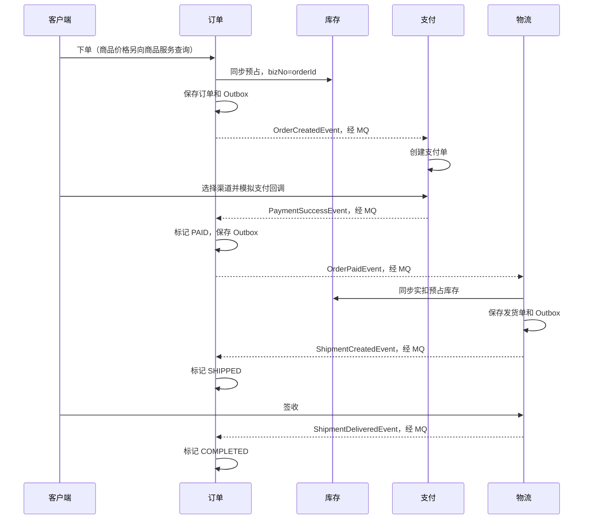

# 从零读懂 DDD：购物平台学习、使用与开发指南

> 适用对象：会写 Java 类、了解 Spring Boot Controller / Service / Repository，但第一次接触 DDD 的开发者。
> 本文对应 `springboot-ddd-project/pom.xml` 管理的项目，以现有代码为主线。标有“练习”的功能是学习任务，不代表项目已经实现。
> 核心目标：遇到需求时，能判断“业务规则由谁负责、代码放哪层、哪些数据必须一起正确”，而不只是记住目录名。

## 阅读导航

**第一次来：直接从 [1.1 跑通第一个小实验](#11-先跑通一个不需要八服务的小实验) 开始。** 不需要先读完本文，也不需要先配置数据库和 MQ。

- [1. 先建立学习路线](#1-先建立学习路线)
- [2. DDD 到底改变了什么](#2-ddd-到底改变了什么)
- [3. 从 POM 看懂项目地图](#3-从-pom-看懂项目地图)
- [4. 用订单理解 DDD 核心概念](#4-用订单理解-ddd-核心概念)
- [5. 一段代码究竟放在哪层](#5-一段代码究竟放在哪层)
- [6. 跟着一次下单读源码](#6-跟着一次下单读源码)
- [7. 理解跨服务事务与事件](#7-理解跨服务事务与事件)
- [8. 把项目运行起来](#8-把项目运行起来)
- [9. 手动完成一次购物流程](#9-手动完成一次购物流程)
- [10. 从需求到代码的开发练习](#10-从需求到代码的开发练习)
- [11. 如何测试你的设计](#11-如何测试你的设计)
- [12. 排障与学习验收](#12-排障与学习验收)

本文有两条路线，不必从第 1 章一直读到第 12 章：

- **先学会开发**：[小实验](#11-先跑通一个不需要八服务的小实验) → [Service 怎样演变](#22-看懂贫血模型和有行为的模型) → [商城比喻](#24-把系统想成一家有分工的商城) → [职责判断](#56-用三句话判断一段逻辑放在哪里) → [备注练习](#103-进阶练习只允许未支付订单修改备注) → [独立练习](#124-独立练习不照抄完整答案)。
- **再读完整系统**：[启动与驱动](#63-程序从哪里启动又是谁调用这些类) → [订单逐站流转](#64-把一张订单从输入追踪到数据库) → [事件接力](#76-从下单到签收每一棒具体交给谁) → 第 8～9 章真实联调。

标为“进阶”的折叠内容可以第二遍再读；身份校验、状态限制、事务边界和已知可靠性缺口不能跳过。

其他资料：[项目总览](../README.md) ｜ [配置、接口和验收手册](operations.md)

## 1. 先建立学习路线

### 1.1 先跑通一个不需要八服务的小实验

先证明一件具体的事：**一张已付款订单，即使没有 Controller 拦截，也不能被普通取消。** 本实验只增加测试，不改业务规则。

**准备**：JDK 21、Maven 3.9+，IDEA 已导入项目。所有命令都在仓库根目录 `springboot-collection-jdk21` 执行。先用 `mvn -version` 确认 Maven 使用 Java 21；首次解析依赖需要联网。

**① 运行现有测试，确认起点正常。** 打开 [OrderDomainTest.java](../ddd-order-service/src/test/java/com/example/ddd/order/OrderDomainTest.java)，先执行：

```bash
mvn -f springboot-ddd-project/pom.xml -pl ddd-order-service -am -Dtest=OrderDomainTest -Dsurefire.failIfNoSpecifiedTests=false test
```

在当前未做练习的代码中，应看到 `Running com.example.ddd.order.OrderDomainTest`、该类 `Tests run: 4, Failures: 0, Errors: 0`，最后 `BUILD SUCCESS`。`-am` 连同共享模块构建，最后一个参数允许共享模块没有同名测试；因此不能只看绿色结尾，还要确认订单测试确实运行。

**② 加一个业务场景，再运行同一命令。** 将以下方法放进 `OrderDomainTest` 类的最后一个 `}` 前，复用现有 `order()` 和 import：

<!-- tutorial:warmup-test -->
```java
@Test
void paidOrderCannotBeCancelled() {
    var order = order();
    order.pay("MOCK", "trade-learning", LocalDateTime.now());

    assertThatThrownBy(() -> order.cancel("USER_CANCEL", "误操作"))
            .isInstanceOf(BusinessException.class);
    assertThat(order.getStatus()).isEqualTo(OrderStatus.PAID);
}
```

预期变为 **5 个测试、0 失败**。`assertThatThrownBy` 表示“必须抛异常才算测试成功”，不是忽略错误。取消被拒绝后仍为 PAID，才是我们要保护的业务结果。

**③ 故意写错预期，看见测试真的能报警。** 只把刚加方法最后一行的 `OrderStatus.PAID` 改成 `OrderStatus.CANCELLED`，再运行：预期 `BUILD FAILURE`，失败详情显示期望 CANCELLED、实际 PAID。随后只把这一处改回 PAID，重新运行应恢复成功。不要修改状态机来迎合错误的测试。

**④ 回到源码解释原因。** 给 [Order.cancel](../ddd-order-service/src/main/java/com/example/ddd/order/domain/model/aggregate/Order.java) 的状态机检查打断点，在 IDEA 中 Debug 刚加的测试：

```text
JUnit 测试 → Order.pay → Order.cancel → 状态机拒绝 PAID → CANCELLED
```

这个调用栈没有 HTTP、数据库或 MQ。你已经亲手验证：规则由订单对象保护，不依赖“入口恰好记得校验”。接下来再读第 2.2 节，理解为什么要这样安排。

| 卡在哪里 | 先检查什么 |
|---|---|
| 不支持 release/source 21 | `mvn -version` 的 Java 和 IDEA Maven Runner JRE |
| 找不到 POM、模块或测试 | 执行目录、完整命令、测试类名；不要去掉 `-am` |
| 依赖下载失败 | Maven 仓库、网络或本地 settings；此时无需启动 MySQL |
| 测试数量没有增加 | 方法是否在类内、有 `@Test`、文件是否已保存 |
| 修正预期后仍失败 | 看 `ddd-order-service/target/surefire-reports` 的具体失败，而不是只看最后一行 |

### 1.2 每次学习只完成一个小目标

| 阶段 | 要做的事 | 完成标志 |
|---|---|---|
| 第一次：获得反馈 | 完成上面的小实验 | 看过成功、预期错误导致的失败、再次成功 |
| 第二次：理解职责 | 读第 2.2、2.4、5.6 节，按需查第 3～5 章 | 能解释哪些规则留在 Order、哪些步骤留在应用服务 |
| 第三次：开发一个用例 | 做第 10.3 节到第九步 | 无外部组件也能证明备注规则、归属和数据库往返 |
| 第四次：接通系统 | 读第 6～7 章，按第 8～9 章联调，再做第十步 | 能区分本地提交、HTTP 返回、异步完成 |
| 第五次：独立迁移 | 完成第 12.4 节，不先看提示 | 自己列出规则、文件、测试与不做的事情 |

基础知识按遇到的问题补：读不懂金额计算再看 `BigDecimal`，读不懂装配再看依赖注入，做到持久化测试再看事务。暂时不需要精通所有中间件。

## 2. DDD 到底改变了什么

DDD 是 Domain-Driven Design，中文是“领域驱动设计”。这里的“领域”不是包名，而是你要解决的业务问题。

假设需求是：“用户可以取消尚未支付的订单，取消后要释放预占库存。”

### 2.1 从业务问题出发，而不是先建表

先回答下面几个问题：

1. 谁发起？订单所属用户，或超时关单任务。
2. 谁判断能不能取消？订单自己，根据当前状态判断。
3. 什么必须始终正确？已付款订单不能走未付款取消流程；取消不能把别人的库存释放掉。
4. 哪些事情可以稍后完成？订单取消落库后，库存释放、支付关单可通过事件异步完成。
5. 失败、重复请求怎么办？重复取消不重复产生副作用；库存释放失败要允许重试。

这些答案再落成模型、方法、事务和接口。表结构是实现模型的手段，不是业务设计的全部。

### 2.2 看懂“贫血模型”和“有行为的模型”

“我在普通 Service 里也会校验，为什么还要 DDD？”这是一个合理的问题。先看它怎样随需求演变，下面前两段是**历史方案的伪代码，不是当前项目可复制的 API**。

**阶段 A：只有用户取消，一个普通 Service 完全可以做对。**

```text
普通 Service.cancelByUser(id, 当前用户, 原因)，在本地事务中：
    order = 仓储读取并锁定(id)
    检查当前用户是订单本人
    如果已经 CANCELLED：返回
    如果不是 CREATED：拒绝
    设置取消状态、原因、时间
    保存订单及待发送的取消通知
```

这段设计有授权、状态校验、事务和事件记录，并不是“用了 Service 就错了”。如果业务一直很简单，保留它就可以。

**阶段 B：增加超时关单和消息入口，开始出现重复规则的风险。**

```text
用户 Controller → cancelByUser：检查本人、判断 CREATED、改状态、记录取消
超时任务         → closeExpired：判断超时、判断 CREATED、改状态、记录取消
消息处理         → cancelByMessage：检查事件、判断 CREATED、改状态、记录取消
```

如果各入口各写一份，后来增加“取消时间必填”就容易漏改。第一种解决办法是抽出公共 Service 方法，三个入口都调用它；**仅仅出现多个入口，并不足以证明必须上 DDD**。消息取消在这里是演进假设，当前项目实际的取消驱动是用户请求和超时任务。

**阶段 C：支付、取消、发货、退款都在操作同一张订单，把订单的规矩收回订单。**

当这些行为共享状态限制、金额快照等约束时，模型可以只开放有业务含义的入口，不再让调用者随意 `setStatus`：

```text
Order.cancel：判断状态 → 修改状态/原因/时间 → 收集取消事实
Order.pay：判断状态 → 记录付款 → 收集已付事实
Order.ship：判断状态 → 记录发货 → 收集已发货事实
```

这对应本项目实际的 [Order](../ddd-order-service/src/main/java/com/example/ddd/order/domain/model/aggregate/Order.java)。任意正常调用方都要经过同一个业务入口；第 1.1 节的测试正是直接调用对象来验证它。

应用服务没有消失，而是保留“办成一次业务”的安排。对照实际 [OrderApplicationService.cancel](../ddd-order-service/src/main/java/com/example/ddd/order/application/service/OrderApplicationService.java)：

```text
事务内：读取并锁定订单 → 检查操作者 → 已取消则返回
      → order.cancel(...) → 保存订单 → 把收集的事件写入 Outbox
```

| 从普通 Service 中分出的职责 | 最终放哪里 | 为什么 |
|---|---|---|
| 当前用户是否有权操作 | 应用用例 | 不同驱动方有不同授权方式 |
| 哪个状态能取消、取消后记录什么 | Order / 状态机 | 换入口或数据库，规则仍成立 |
| 事务、先读取再保存、通知持久化 | 应用服务 | 协调一次用例完成 |
| 如何锁行、如何映射、如何发消息 | 基础设施 | 技术手段不决定业务规则 |

“贫血模型”通常指对象只有数据，行为在外部 Service；“有行为的模型”把规则和数据放回所属对象。选择后者的收益是统一保护越来越复杂的规则，代价是更多模型、转换与协作设计。**简单 CRUD 不必为了目录齐全而套用整套结构。**

### 2.3 DDD 不等于这些东西

- 不等于微服务：单个 Spring Boot 应用也能采用 DDD。
- 不等于四层目录：建好目录但仍到处直接改状态，业务设计并没有改善。
- 不等于 JPA：换成 MyBatis，订单的支付、取消规则仍应成立。
- 不等于所有功能都发消息：需要即时结果时可以同步调用。
- 不等于每张表都建一个聚合：聚合按一致性规则划分，不按表数量划分。

### 2.4 把系统想成一家有分工的商城

小林买了两件商品。现实中不是一个柜员既改商品目录、又管仓库钥匙、又替银行记账。软件同样需要明确“谁对哪件事有最终决定权”。

| 商城中的角色 | 项目对应 | 它有权决定什么 | 它不能替谁决定 |
|---|---|---|---|
| 门禁验身份 | auth | Token 对应谁 | 某张订单能不能取消 |
| 会员资料室 | user | 地址簿、资料、角色权限 | 旧订单寄往哪里 |
| 商品目录部门 | product | 当前在卖什么、售价多少 | 已成交订单应收多少钱 |
| 仓库 | inventory | 某业务号能否预占或实扣 | 用户是否真的付了钱 |
| 交易柜台 | order | 成交明细、金额快照、订单状态 | 银行收款是否成功 |
| 收银台 | payment | 支付单、收款流水、退款 | 实物是否已回仓 |
| 发货部门 | logistics | 发货单、轨迹、签收 | 擅自把订单金额改为零 |
| 顾客手里的购物篮 | cart | 想买什么、选中什么 | 保证最终有货、锁定成交价 |

这就是“限界上下文”的直觉：不是把大项目平均切成八份，而是给每套业务规则划定负责人。本项目恰好把它们部署成八个服务；小项目也可以先放在一个进程里。

再走进订单部门，四层不是四个业务部门，而是同一部门里的分工：

```text
顾客 → 接待窗口（Controller）：核对身份，把诉求填成标准申请单
          ↓
      业务经办人（ApplicationService）：取订单、安排核验、保存结果
          ↓
      订单及规章（Order / 状态机）：这张订单究竟允许做什么
          ↓
      档案室、电话、邮政（Repository 实现 / Gateway / Outbox）：落实技术操作
```

应用服务像经办人，不是有权随意改规则的“万能经理”。“先拿档案，再处理，再归档”由它安排；“付过款不能按未付款订单取消”由订单模型把关。Java 对象当然不是真人，这个比喻只帮助理解职责，不能替代代码中的事务与并发控制。

### 2.5 跟产品经理聊一次取消需求

下面是把一句话需求变成设计的过程，不是要求你先背术语：

| 你追问的问题 | 本项目规则或需要确认的答案 | 因而产生的代码决策 |
|---|---|---|
| “能取消订单”是谁能取消？ | 用户只能取消自己的；超时任务可内部触发 | HTTP 从 Token 取用户，应用用例校验归属 |
| 付款后还叫取消吗？ | 不叫，走退款；普通取消只针对 CREATED | `Order.cancel` 调状态机，不提供任意状态 setter |
| 点两次怎么办？ | 同一张已取消订单不再重复处理 | 应用层识别 CANCELLED 后返回 |
| 用户取消时支付消息也到了呢？ | 同一订单的本地写操作不能交叉覆盖 | `findForUpdate` 和事务内重新判断状态 |
| 库存、支付单何时处理？ | 订单取消提交后，分别通知相关服务 | 订单和取消事件同事务写入，后续消费者各自处理 |
| 库存服务临时不可用怎么办？ | 应具备可重试、可对账的恢复路径 | 继续检查适配器是否抛错，不能只看到 MQ 就认定可靠 |

由此得到的是一个行为 `cancel`，不是一个通用接口 `updateOrder(status)`。将来新增“定时取消”入口时，复用同一应用用例；不再把前五条规则复制进定时任务。

DDD 的“驱动”首先指**业务含义驱动代码结构**：业务说“取消”，代码就表达“取消”，而不是只表达“把 status 改成 2”。事件驱动则是**运行时协作方式**，两者不是一回事；第 6、7 节会展示具体由谁执行。

## 3. 从 POM 看懂项目地图

### 3.1 三层 Maven 关系

```text
仓库根 pom.xml：Spring Boot 3.2.0、JDK 21 等公共配置
└── springboot-ddd-project/pom.xml：DDD 父工程，packaging=pom
    ├── ddd-common：共享模型与公共设施，不单独启动
    ├── ddd-api-contract：服务间契约，不单独启动
    └── 八个 ddd-*-service：独立 Spring Boot 应用
```

打开 [DDD 父 POM](../pom.xml)，按以下顺序看：

| POM 节点 | 新手理解方式 |
|---|---|
| `parent` | 继承仓库父工程配置；不要只复制 DDD 目录就期待完全独立构建 |
| `packaging=pom` | 当前是组织模块的父工程，不是可以运行的 Web 服务 |
| `modules` | 本次 Maven 递归构建要包含哪些子模块 |
| `dependencies` | 这里声明的依赖会被子模块继承 |
| `dependencyManagement` | 统一管理依赖版本，本身不等于引入全部依赖 |
| `pluginManagement` | 管理插件默认配置，不等于每个插件都会自动执行 |

例如 [订单服务 POM](../ddd-order-service/pom.xml) 自己声明 Web、JPA、Feign 等依赖，并绑定 `repackage` 生成可执行 JAR。

业务服务依赖共享模块和契约模块，但不直接依赖其他业务服务的实现 JAR。订单要查商品，走 HTTP 契约，不导入商品服务的仓储。

### 3.2 八个上下文分别回答什么问题

“限界上下文”可以先理解为：一套业务语言和规则有效的边界。同名概念在不同边界内，不一定是同一个模型。

| 模块 | 端口 | 数据库 | 业务关注点 |
|---|---|---|---|
| `ddd-auth-service` | 8081 | `ddd_auth` | 你是谁？能否登录？Token 是否有效？ |
| `ddd-user-service` | 8082 | `ddd_user` | 用户资料、地址簿、角色和权限 |
| `ddd-product-service` | 8083 | `ddd_product` | 卖什么？什么规格？当前售价与上下架状态？ |
| `ddd-inventory-service` | 8084 | `ddd_inventory` | 哪个仓库还有多少？能否预占、实扣或释放？ |
| `ddd-order-service` | 8085 | `ddd_order` | 买了什么？成交多少？订单处于什么阶段？ |
| `ddd-payment-service` | 8086 | `ddd_payment` | 是否收款？支付流水、退款单和渠道是什么？ |
| `ddd-logistics-service` | 8087 | `ddd_logistics` | 包裹是否发出、运输、签收？ |
| `ddd-cart-service` | 8088 | `ddd_cart` | 想买什么？选中哪些条目？预览多少钱？ |

本项目把这些边界部署成独立服务，并在一个本地 MySQL 实例内使用不同数据库。DDD 本身不要求一个上下文必须部署成一个进程。

### 3.3 同一个商品，为什么有多种表示

- 商品上下文：`Spu` 表示一类商品，`Sku` 表示可售卖的具体规格，例如某型号手机的“黑色 256G”。
- 库存上下文：关注某个 `skuId` 在某个仓库的数量，不需要整棵商品详情对象。
- 订单上下文：保存购买时的名称、规格、单价和数量快照。商品后来涨价，旧订单金额不能跟着变。
- 购物车上下文：表达购买意向，预览时刷新价格，不承诺成交价格。

统一语言不是“全系统强行复用一个 Product 类”，而是业务人员和开发者在约定边界内对术语含义达成一致。

战略设计先讨论边界与协作，战术设计再讨论边界内部的聚合、实体、值对象等代码结构。不要把两者颠倒。

## 4. 用订单理解 DDD 核心概念

### 4.1 实体：靠身份区分

订单金额一样、商品一样，也可能是两笔不同订单，靠 `orderId` 区分。因此 `Order` 是实体，同时也是聚合根。

[OrderItem](../ddd-order-service/src/main/java/com/example/ddd/order/domain/model/entity/OrderItem.java) 有自己的 `itemId`，是订单聚合内部的子实体。它记录购买时的商品信息，不是远程商品对象本身。

### 4.2 值对象：靠内容区分

[Money](../ddd-common/src/main/java/com/example/ddd/common/domain/valueobject/Money.java) 表示“金额 + 币种”，没有独立业务 ID。

```java
Money unitPrice = Money.ofCny("19.90");
Money subtotal = unitPrice.multiply(2);
// unitPrice 仍为 19.90 CNY，subtotal 为新对象 39.80 CNY。
```

它把“禁止负数、按币种精度舍入、不同币种不能直接相加”等规则集中起来，避免每个 Service 手写一遍。

[Address](../ddd-common/src/main/java/com/example/ddd/common/domain/valueobject/Address.java) 是订单使用的地址快照。用户地址簿中的可编辑记录和某张订单的收货地址快照，不是同一个生命周期。

注意：`record` 不是“值对象”的同义词。它也能承载 DTO，甚至承载具有业务身份的条目；是否是值对象取决于业务语义。包含可变集合的 `record` 也不天然深度不可变。

### 4.3 聚合：必须一起保持正确的一组对象

```text
Order 聚合
├── Order：聚合根，对外提供 pay / cancel / ship / complete
├── OrderItem 列表：订单明细
├── Money：金额快照
└── Address：地址快照

外部 Product、User、Stock 不放入这个聚合，只保留 ID 或所需快照。
```

[Order](../ddd-order-service/src/main/java/com/example/ddd/order/domain/model/aggregate/Order.java) 保护的规则包括：

- 新建订单至少有一条明细。
- 实付金额 = 商品总额 + 运费 - 优惠。
- 只有合法状态才能发生相应行为。
- 创建后金额和地址快照不可随意修改。

“不变式”就是业务永远不能被破坏的约束，不是“字段永远不能变”。状态可以改变，但改变必须符合规则。

聚合不是“把有关联的对象全部放一起”。[Stock](../ddd-inventory-service/src/main/java/com/example/ddd/inventory/domain/model/aggregate/Stock.java) 独立于仓库聚合，就是为了避免操作一个 SKU 时加载或锁住整个仓库。

一般以聚合作为本地一致性边界，尽量保持小事务。本项目也存在同一上下文内协调多个库存记录等操作；不要机械理解为“一个事务绝对只能写一张表或一个对象”。

### 4.4 工厂：保证出生时就合理

`Order.create(...)` 不只是调用构造器，还会检查输入、设置 `CREATED` 状态、计算到期时间、收集订单创建事件。

`Order.reconstitute(...)` 用来从数据库重建已有订单，不重新产生创建事件。否则每次查询都可能再创建一张支付单。

重建不是毫无约束地接受脏数据：当前实现仍经过构造器的金额一致性检查。“新建业务对象”和“恢复历史状态”是两条不同路径。

### 4.5 领域服务：规则不自然属于一个对象时使用

[OrderPricingService](../ddd-order-service/src/main/java/com/example/ddd/order/domain/service/OrderPricingService.java) 负责定价规则：当前满 99 元包邮，否则运费 10 元，优惠为 0。

它回答“怎么算才对”，而不是“先调用哪个 HTTP 接口”。

[ProductPublishService](../ddd-product-service/src/main/java/com/example/ddd/product/domain/service/ProductPublishService.java) 校验类目、品牌是否可用，是跨聚合业务规则的另一个例子。

先尝试把规则放到所属实体或值对象；确实没有合适归属时再抽领域服务。不要为了类名整齐，把所有业务行为重新塞回一个巨大的 Service。

### 4.6 仓储：站在业务视角存取聚合

[OrderRepository](../ddd-order-service/src/main/java/com/example/ddd/order/domain/repository/OrderRepository.java) 表达“取得或保存订单聚合”。

[OrderRepositoryImpl](../ddd-order-service/src/main/java/com/example/ddd/order/infrastructure/persistence/repository/OrderRepositoryImpl.java) 负责把订单和明细映射成数据库记录。

- Repository 面向聚合；DAO 面向表记录与技术查询。
- 接口放 `domain`，实现放 `infrastructure`，领域不需要知道 JPA 的存在。
- 不是所有关联表都需要一个对应用层公开的领域仓储。

### 4.7 用一个订单档案袋串起这些概念

把一张订单想成一个有编号的档案袋：封面有订单号，里面有明细、成交金额和收货地址。

- **实体**：靠编号认人。两张内容完全相同的订单，仍是两个档案袋，不能混成一张。
- **值对象**：袋里的“99 元人民币”“这段地址”。关注内容，不需要再给每一个金额发身份证；换地址快照是换一个值，不是偷偷改变所有订单共用的地址记录。
- **聚合**：整个档案袋。新增或修改明细时，不能让封面总额与内部数据自相矛盾。这组需要一起正确的数据形成边界。
- **聚合根**：档案袋的业务入口 `Order`。外部通过它办“支付、取消、发货”，不是拿到内部对象就任意改字段。
- **仓储**：按编号取出、归还完整档案袋。落到两张表不影响业务把它看成一张订单。
- **领域服务**：独立的定价规章，输入购买明细，算出金额；不是发短信、调 HTTP 的工具箱。
- **防腐层**：部门间的翻译员。把商品部门的接口数据翻译成订单看得懂的快照。
- **领域事件**：盖章后的通知“订单已取消”。通知不等于对方部门已经完成了库存释放。

为什么不把用户、商品、库存全部装进袋子？因为改用户昵称不应该锁住所有旧订单，改商品售价不应该改写历史成交额，仓库库存还要服务别的订单。业务有联系，不等于必须成为同一个聚合。

新手划边界时，先问：“这个数据能否独立变化？哪个规则必须当场检查并一起保存？”不要用“数据库有外键”作为唯一理由。聚合是业务约束的边界，不是数据库关系图的完整复刻。

## 5. 一段代码究竟放在哪层

### 5.1 先记住四个问题

| 层 | 它回答的问题 | 本项目例子 | 不该成为它的职责 |
|---|---|---|---|
| `interfaces` | 外部怎样调用我？ | 请求校验、Token 解析、Controller、响应转换 | SQL、库存增减、订单状态规则 |
| `application` | 完成这个用例要协调哪些步骤？ | 查商品、调用定价、预占、保存、收集事件的持久化 | 大量业务公式、直接操作 PO |
| `domain` | 什么状态和行为符合业务？ | 订单取消、金额计算、库存不能为负 | HTTP、Redis、MQ、JPA 注解 |
| `infrastructure` | 用什么技术完成外部交互与存储？ | JPA、Feign、Outbox、配置装配 | 决定已付款订单能否取消 |

依赖方向的核心是：

```text
interfaces ──> application ──> domain
                    ↑             ↑
                    └── infrastructure
                        实现端口和仓储
```

这是源码依赖方向，不是运行时调用顺序。应用层运行时会调用注入进来的仓储实现，但编译时只需要认识接口。

### 5.2 用“取消订单”区分应用层和领域层

下面是职责示意，省略具体签名和实现细节：

```text
Controller：读取 orderId、取消原因、认证用户
  ↓
应用服务：开启事务 → 读取并锁定订单 → 检查归属 → 处理重复请求
  ↓
Order.cancel：校验 CREATED → CANCELLED → 记录原因和时间 → 收集事件
  ↓
应用服务：保存订单 → 通过发布端口写 Outbox
  ↓
事务提交后：后台投递事件 → 库存释放、支付关单
```

“是不是当前用户的订单”属于用例授权；“当前业务状态能不能取消”属于领域规则，两者缺一不可。

### 5.3 DTO、Command、Domain、PO 为什么不共用一个类

| 类型 | 面向谁 | 订单例子 |
|---|---|---|
| Request DTO | HTTP 调用方 | `OrderController.CreateRequest` |
| Command | 应用用例 | `PlaceOrderCommand`，用户 ID 由服务端认证结果填入 |
| Domain | 业务规则 | `Order`、`OrderItem`、`Money` |
| PO | 数据库映射 | `OrderPO`、`OrderItemPO` |
| Response / 契约 DTO | 前端或其他服务 | `OrderDTO` |

一个类同时承担所有角色，会把数据库字段、接口兼容要求和业务行为绑死在一起。分开不是为了多写转换器，而是允许它们独立演化。

也不必每次创建一套重复 DTO。当前订单请求直接复用 `Address`、部分查询直接返回契约 DTO，是学习项目的实际选择。

### 5.4 防腐层到底“防”什么

沿下面这条转换链阅读：

[ProductGateway](../ddd-order-service/src/main/java/com/example/ddd/order/application/port/ProductGateway.java) → [ProductGatewayImpl](../ddd-order-service/src/main/java/com/example/ddd/order/infrastructure/rpc/ProductGatewayImpl.java)

```text
订单用例需要：SkuSnapshot（名称、Money、是否在售）
                 ↑ 翻译
商品契约返回：SkuDTO（商品上下文的字段和状态表达）
                 ↑ HTTP
商品服务
```

Gateway 是“我需要什么能力”的端口；Feign 适配器负责“怎样调用”和“怎样翻译”。商品服务改变接口字段时，优先在适配器消化变化，尽量不污染订单模型。

### 5.5 学规范，也要认识现有代码的取舍

本项目不是所有地方都完全隔离到同一程度：

- `application/listener` 中使用了 RocketMQ 注解与公共 `EventInbox`，消息适配与应用层存在技术耦合。
- `CartApplicationService.preview` 仍直接计算预览运费，未像订单那样抽出独立定价领域服务。
- `ddd-common` 同时包含值对象和公共基础设施；不是其中每个包都能被领域层引用。
- 订单聚合直接使用契约模块里的事件类，是减少内部事件到集成事件转换的教学简化。

理解目标是保护业务内核，而不是把现有目录摆放当成不可讨论的标准答案。

### 5.6 用三句话判断一段逻辑放在哪里

拿“用户修改未支付订单备注”举例：

1. “`CREATED` 才允许改，最多 200 字符”——换成命令行操作仍成立，是领域行为。
2. “先取订单、锁住、验证本人、调用修改行为、再保存”——一次用例的步骤，是应用服务。
3. “请求用 PATCH，数据库用 JPA，异常返回 Result”——技术实现或交互协议，放接口层与基础设施。

再做一个反向检查：如果替换数据库，就得修改‘未支付才允许’的规则，说明技术和业务绑得太紧；如果新增 MQ 入口，就得复制这条规则，说明规则没有被放在统一的模型入口。

这不是说应用服务里不能有任何 `if`。归属验证、找不到订单、重复调用这些用例判断本来就需要 `if`；要避免的是状态转换、金额算法等业务规则在各入口重复生长。

区分两种顺序：**运行时**，请求通常从 Controller 向内调用领域行为，再保存；**开发时**，可以先写领域规则及测试，再接应用、存储与接口。从规则开始开发，不代表运行时会由领域对象主动去找 Controller。

## 6. 跟着一次下单读源码

建议在 IDEA 中依次打开下表文件。先看方法调用，不必立即钻进 Spring 或 Hibernate 源码。

| 顺序 | 源码入口 | 读的时候回答 |
|---|---|---|
| 1 | [OrderController.create](../ddd-order-service/src/main/java/com/example/ddd/order/interfaces/rest/OrderController.java) | 为什么请求不接受 userId 和成交价？ |
| 2 | [PlaceOrderCommand](../ddd-order-service/src/main/java/com/example/ddd/order/application/command/PlaceOrderCommand.java) | HTTP 请求怎样变成应用用例输入？ |
| 3 | [OrderApplicationService.placeOrder](../ddd-order-service/src/main/java/com/example/ddd/order/application/service/OrderApplicationService.java) | 哪些步骤是远程操作，哪些是本地操作？ |
| 4 | [OrderPricingService.price](../ddd-order-service/src/main/java/com/example/ddd/order/domain/service/OrderPricingService.java) | 运费规则归谁？ |
| 5 | [Order.create](../ddd-order-service/src/main/java/com/example/ddd/order/domain/model/aggregate/Order.java) | 新订单满足哪些不变式？ |
| 6 | [OrderRepositoryImpl.save](../ddd-order-service/src/main/java/com/example/ddd/order/infrastructure/persistence/repository/OrderRepositoryImpl.java) | 一个聚合如何存到订单和明细表？ |
| 7 | [OrderConverter](../ddd-order-service/src/main/java/com/example/ddd/order/infrastructure/persistence/converter/OrderConverter.java) | Money、Address、枚举如何映射？ |
| 8 | [OrderConfiguration](../ddd-order-service/src/main/java/com/example/ddd/order/infrastructure/config/OrderConfiguration.java) | 纯 Java 领域服务和事件发布端口怎样装配？ |
| 9 | [EventOutbox](../ddd-common/src/main/java/com/example/ddd/common/infrastructure/messaging/EventOutbox.java) | publish 为什么不等于立刻发到 MQ？ |

实际下单顺序是：

1. Controller 通过 auth 解析 Token，以真实用户身份构造 Command。
2. 应用服务检查明细非空、重复 SKU，然后通过商品 Gateway 查询可售状态和价格。
3. 创建订单项快照，通过领域服务计算金额。
4. 创建订单聚合并暂存 `OrderCreatedEvent`，此时还没有发送消息。
5. 注册本地事务回滚后的库存释放补偿，再以 `orderId` 为业务号远程预占。
6. 保存订单及明细；通过发布端口把事件写入同一数据库事务中的 Outbox。
7. 本地事务提交，HTTP 返回订单 ID。
8. 后台任务发送已提交事件，支付服务收到后创建支付单。

因此，返回 `orderId` 并不意味着支付单已经创建。查不到时先检查异步链路，不要再次下单。

### 6.1 对照实际状态机

[OrderStateMachine](../ddd-order-service/src/main/java/com/example/ddd/order/domain/statemachine/OrderStateMachine.java) 当前允许：

| 当前状态 | 允许到达 |
|---|---|
| `CREATED` | `PAID`、`CANCELLED` |
| `PAID` | `SHIPPED`、`REFUNDING` |
| `SHIPPED` | `COMPLETED`、`REFUNDING` |
| `COMPLETED` | `REFUNDING` |
| `REFUNDING` | `REFUNDED` |
| `CANCELLED`、`REFUNDED` | 无 |

注意两个容易误读的地方：

- 已完成订单在本学习项目中仍允许全额退款，不是不可变终态。
- 用户退款入口在支付服务；订单收到退款成功事件后，在同一个本地事务中推进 `REFUNDING → REFUNDED`。当前没有独立的订单退款审批流程。

### 6.2 最有学习价值的断点

第一次断点放在 `placeOrder`、`Order.create`、`OrderConverter.toPO`。
第二次放在 `EventOutbox.dispatch`、`PayApplicationService.create`、`OrderEventListeners.Payment.onMessage`。

观察对象：Command、商品快照、Order、事件列表、数据库 PO。

MQ 消费运行在另一个线程甚至另一个进程里，不会一直出现在同一个调用栈。跨进程用 `orderId` 追业务、用 `eventId` 追消息。

长时间停在持锁事务或消费者断点上，可能触发 RPC 超时、MQ 重试或 Redis 租约到期。调试出现重复消费时先考虑这个原因。

### 6.3 程序从哪里启动，又是谁调用这些类

先分清“开门营业”和“办理一笔业务”。

**开门营业的入口**是 [OrderApplication.main](../ddd-order-service/src/main/java/com/example/ddd/order/OrderApplication.java)：

```text
main → SpringApplication.run → 创建 Spring 容器
     → 扫描订单包和 common 包，装配 Bean
     → 配置数据库/JPA/Feign/MQ/定时调度
     → 接收请求、消息与定时触发
```

不是每下一笔订单都执行一次 main。订单服务启动后，三种入口持续等候工作：

| 谁来敲门 | 框架怎样找到入口 | 真实入口 | 后续调用 |
|---|---|---|---|
| 用户发 HTTP | Spring MVC 匹配 URL 与注解 | `OrderController.create` / `cancel` | `placeOrder` / `cancel` |
| Broker 推送消息 | RocketMQ 按 Topic、Tag、消费组分发 | `OrderEventListeners.Payment.onMessage` | `markPaid` / `refunded` |
| 时间到了 | Spring 调度 `@Scheduled` 方法 | `OrderTimeoutJob.closeExpired` | 查询过期订单，逐单 `cancel` |
| 有待发送事件 | Spring 周期调度 | `EventOutbox.dispatch` | 扫描本地消息表，向 Broker 投递 |

`OrderApplication` 上的 `@EnableScheduling` 开启定时调度，`@EnableFeignClients` 为契约接口建立 HTTP 代理；仅有这些注解并不意味着下单规则自动执行。规则仍由实际方法调用触发。

**这些接口没有 new，实现从哪里来？** 以构造器注入为例：

| `OrderApplicationService` 构造器需要 | Spring 在当前项目中提供 |
|---|---|
| `OrderRepository` | `@Repository` 标记的 `OrderRepositoryImpl` |
| `ProductGateway` | `ProductGatewayImpl`，内部用 Feign 访问商品 |
| `InventoryGateway` | `InventoryGatewayImpl`，内部用 Feign 访问库存 |
| `OrderPricingService` | `OrderConfiguration.pricingService()` 创建的 Bean |
| `DomainEventPublisher` | `OrderConfiguration.orderEvents()` 返回的 lambda，调用 Outbox |

接口是插座，适配器是插头，Spring 负责把它们接起来。应用服务只使用插座约定，不负责亲自组装数据库驱动。若增加第二个同类型实现，则需要明确选择；Spring 不会理解业务后自动挑一个。

`Order` 则不是所有请求共享的单例 Bean。`Order.create` 或 `Order.reconstitute` 每次得到对应的业务对象。不要给订单对象加 `@Service`，也不要把某张订单存成应用服务的可变成员字段。

**事务又是谁开启的？** Controller 调用的是 Spring 注入的应用服务代理：

```text
Controller → 事务代理：开始本地事务
           → placeOrder 方法体
           → 事务代理：提交成功，或异常回滚
           → Controller：构造 Result，写 HTTP 响应
```

方法体写了 `return orderId`，不等于事务已经提交；代理提交失败仍会向外抛异常。自己 `new OrderApplicationService(...)` 不会自动得到该代理，同一对象内部的自调用也不能依赖代理重新开启事务。领域方法本身不需要注解，它在调用方建立的用例边界内执行。

### 6.4 把一张订单从输入追踪到数据库

下面用可手算的教学数据：小林购买两件单价 20 元的商品，总额 40 元，未满 99 元，加 10 元运费，实付 50 元。**20 元只是讲解假设，不是当前种子 SKU 的价格**；真实调用按商品查询结果计算，第 9 节有完整 JSON。

| 站点 | 进入这一站的东西 | 本站方法与工作 | 出站结果及所在位置 |
|---|---|---|---|
| 1. 接待窗口 | Authorization、JSON：SKU、数量、地址、备注 | `OrderController.create` 解析 Token、绑定 `CreateRequest` | 已认证 userId 与请求字段，尚未创建订单 |
| 2. 填申请单 | Request + 服务端身份 | `new PlaceOrderCommand(...)` | 只表达下单意图的 Java 数据对象，不会自己执行 |
| 3. 核对商品 | Command | `placeOrder` 校验明细，经 `ProductGateway.getSku` 取价和在售状态 | 订单自己的 `SkuSnapshot`，不是商品聚合 |
| 4. 留成交底稿 | SKU 快照、数量 2 | `new OrderItem(...)` | 明细小计 40 元及商品名/规格快照 |
| 5. 算账 | 明细列表 | `OrderPricingService.price` | `PricingResult`：40 + 10 - 0 = 50 |
| 6. 建档案袋 | ID、明细、金额、地址 | `Order.create` 校验、设置 CREATED、登记事件 | 内存里的 Order 与一个 OrderCreatedEvent |
| 7. 打电话留货 | orderId、SKU、数量 | 注册回滚回调，再 `InventoryGateway.lock` | 远程库存服务提交预占；本地订单还未提交 |
| 8. 归档 | Order | `OrderRepositoryImpl.save` → Converter → DAO | 本地事务中的订单和明细记录 |
| 9. 留通知底单 | Order 的事件列表 | `publishEvents` → 发布端口 → `EventOutbox.append` | 同一本地事务中的 `t_event_outbox` 记录 |
| 10. 办理结束 | 方法返回 orderId | Spring 事务代理提交 | 业务与通知底单一起持久化，Controller 返回成功 |
| 11. 邮递员工作 | 已提交的待发消息 | `EventOutbox.dispatch` | 消息到 Broker；支付服务另起线程处理 |

这里有四个容易被“自动”二字掩盖的动作：

- `new PlaceOrderCommand` 只是填申请单；是 Controller 显式调用 `service.placeOrder` 才开始办理。本项目没有隐藏的命令总线。
- `Order.create` 创建普通 Java 对象；没有 `repository.save`，对象不会自动进数据库。
- `registerEvent` 只把事件对象加入 `BaseAggregateRoot` 的内存列表；没有发布端口和 Outbox，不会自动进 MQ。
- 只有消息消费者明确订阅并调用下一个用例，后续支付/发货才会发生；事件类名本身没有调度能力。

**同一条数据为什么换了几次衣服？**

```text
JSON quantity=2                           面向网络，可能不可信
 → OrderController.Item                   面向 HTTP 参数绑定
 → PlaceOrderCommand.Item                 面向下单用例
 → OrderItem(unitPrice=Money, quantity=2)  面向成交规则和快照
 → OrderItemPO / OrderPO                  面向 JPA 与表字段
 → 数据库记录                             跨进程重启保留
```

请求不携带可信成交价，Command 不负责 SQL，PO 不对前端公开。不同类型是不同边界的载体，不是把一个对象反复改名。

**持久化最后一公里**，对照 [OrderRepositoryImpl](../ddd-order-service/src/main/java/com/example/ddd/order/infrastructure/persistence/repository/OrderRepositoryImpl.java) 和 [OrderConverter](../ddd-order-service/src/main/java/com/example/ddd/order/infrastructure/persistence/converter/OrderConverter.java)：

```text
写：Order + OrderItem
    → Converter 转成 OrderPO + OrderItemPO
    → DAO/JPA 保存（SQL 可能在 flush 或提交时执行）
    → 本地事务提交

读：OrderRepository.findById
    → DAO 查订单表和明细表
    → Converter 将字段还原成 Money、Address、枚举、明细
    → Order.reconstitute 恢复已有订单
    → Controller.toDTO → Result → JSON
```

领域对象不是 JPA 托管实体；调用 `order.cancel` 改的是内存模型，仍需显式保存。查询也不会重新问商品服务计算旧订单价格，更不能用 `create` 代替 `reconstitute`，否则会误制造创建事件。

### 6.5 亲手追一次取消：一次请求在何处结束

在未付款订单上调用 `POST /orders/{id}/cancel`，沿着这些现有方法看：

1. `OrderController.cancel` 从路径拿 id，从 Token 拿 userId，从请求拿 reason；构造 USER_CANCEL 原因，不接受前端任意指定操作者。
2. `OrderApplicationService.cancel` 经事务代理进入事务，`loadOrder` 调仓储的 `findForUpdate`。
3. [OrderDao.findForUpdate](../ddd-order-service/src/main/java/com/example/ddd/order/infrastructure/persistence/dao/OrderDao.java) 使用 `PESSIMISTIC_WRITE`。锁保护的是该订单的本地数据库写流程，不是锁住远程支付服务。
4. `assertOwner` 校验归属；如果已经 CANCELLED，直接返回，不再生成取消事件。
5. `Order.cancel` 调 `OrderStateMachine.assertCanTransition`，成功后改状态、记录原因和时间、登记 `OrderCancelledEvent`。
6. 应用服务保存订单并 `publishEvents`。取消状态与消息底单一起提交后，HTTP 请求完成。
7. Outbox 后台投递；订单服务的库存释放消费者与支付服务的关单消费者分别处理。**HTTP 成功并不等于这两个消费者此刻都完成。**

如果改从定时入口进来呢？打开 [OrderTimeoutJob.closeExpired](../ddd-order-service/src/main/java/com/example/ddd/order/infrastructure/job/OrderTimeoutJob.java)：默认每次执行结束后等待 60 秒扫描，最多取 100 张超时未付款订单，逐张调用 `service.cancel(id, null, "TIMEOUT", "超过支付期限")`。每次调用经另一个 Bean 的代理进入事务，不需要复制取消规则。

这里的 null userId 是当前内部任务跳过用户归属检查的约定，不是用户接口可以匿名操作的依据。新增面向用户的用例必须验证身份非空，第 10.3 节会专门处理。

| 分支 | 谁负责阻止错误 | 最后应观察什么 |
|---|---|---|
| 别人取消我的订单 | 应用服务归属检查 | 本地状态、Outbox 不变化 |
| 我连续取消两次 | 应用服务已取消分支 | 一次有效取消，不重复生成事件 |
| 已付款后再取消 | 领域状态机 | 拒绝，不把 PAID 改成 CANCELLED |
| 取消和支付成功消息并发 | 同一订单行锁，获得锁后再判断 | 本地状态不被交叉覆盖；跨服务收款结果仍靠补偿协调 |
| 保存或 Outbox 插入失败 | 本地事务回滚 | 取消不提交，也没有对应取消消息可发 |
| 取消提交但释放库存失败 | 消费端、适配器及补偿设计 | 不能把本地成功当作全链路成功，见第 7.7 节现状限制 |

**练习断点**：先停 `cancel` 看 status，再进 `Order.cancel` 看事件列表，接着看 Outbox 插入。放行本地事务后，切到消费者的运行配置观察同一个 orderId。不要为了“让所有步骤停在一起”长时间持有锁。

## 7. 理解跨服务事务与事件

### 7.1 一张流程图



不能渲染 Mermaid 时，把它读成：下单预占 → 支付单创建 → 支付成功 → 订单已付 → 物流实扣并发货 → 签收完成。

命令是“请做一件事”，例如取消订单；事件是“已经发生的事实”，例如订单已取消。不是每个内部行为都需要发布成跨服务事件。

### 7.2 库存的三个动作不能混淆

用可用库存 10、预占库存 0，购买 2 件举例：

| 动作 | 可用库存 | 预占库存 | 含义 |
|---|---|---|---|
| 初始 | 10 | 0 | 尚未购买 |
| 下单预占 `lock` | 8 | 2 | 暂时不给其他订单购买 |
| 取消释放 `unlock` | 10 | 0 | 取消这次预占，回到初始状态 |
| 若预占后发货实扣 `deduct` | 8 | 0 | 这 2 件已进入履约，不再是仓内可用数量 |

最后两行是两条分支，不是连续执行。实扣不会再次把可用数量从 8 减成 6。

释放按业务号管理，不能只看“系统一共锁了多少”。否则重复取消可能误释放另一张订单的预占。

### 7.3 本地事务管不到远程数据库

订单服务的 `@Transactional` 能回滚订单本地数据库，不会自动回滚库存服务已经提交的预占。

当前实现有即时补偿：订单事务回滚后尝试调用库存释放。但进程崩溃、网络失败仍可能留下预占，需要对账或进一步引入持久化补偿流程。

正常取消则先提交订单取消及 Outbox，再由取消事件驱动库存释放，避免“订单取消回滚了，远程库存却释放了”。

### 7.4 Outbox 解决哪一半问题

订单、支付、物流使用本地消息表：

```text
同一个本地事务：业务数据 + t_event_outbox
    ↓ 提交成功后可见
后台 dispatch：扫描 sent=0 → 发 MQ → Broker 确认后标记 sent=1
```

它避免“业务已提交，但待发送事件根本没留下来”的窗口。

它不保证：

- 消息只投递一次：发送成功但标记失败会重发。
- 消息全局有序：不同事务、生产者、消费者之间可能乱序。
- 远程库存与订单数据库构成一个原子事务。
- 所有业务失败都会自动永久重试并最终成功：还需要故障恢复、死信处理、告警与对账。

当前 auth/user/product/inventory 的早期发布器仍采用提交后直接发送，不要把三个新链路服务的 Outbox 保证推广到所有模块。

### 7.5 重复消息为什么不应该重复扣款

首次只记住：同一通知可能到达多次，业务不能多扣款、多建单；接收端要识别重复，数据库约束和业务状态也要兜底。**如果内部吞掉异常，就可能把失败当成已完成**，第 7.7 节的现有缺口必须注意。

<details>
<summary>进阶：Redis 租约、完成标记和数据库兜底</summary>

[EventInbox](../ddd-common/src/main/java/com/example/ddd/common/infrastructure/messaging/EventInbox.java) 当前使用 Redis，而不是数据库 Inbox 表：

1. 按“消费者 + eventId”检查是否处理完成。
2. 获取 2 分钟租约，减少并发处理。
3. 执行业务；只有成功返回后才写 24 小时完成标记。
4. 如果业务异常传播出来，本次不会写完成标记，异常交给 MQ 处理后续重试。内部吞掉异常时，这个保证不成立，见第 7.7 节。

Redis TTL 不是永久正确性的保证。支付单按订单唯一、退款单按支付单唯一、发货单按订单唯一，再配合数据库锁和领域状态判断兜底。

例如重复支付回调应返回已有成功结果，不再次制造成功事件。订单应用服务也会过滤重复或迟到事件，但聚合本身仍严格拒绝非法状态跳转。

</details>

幂等是“重复执行同一业务请求，效果与执行一次一致”。不是每个 POST 天然幂等：当前下单没有客户端幂等键，加购也会累计数量，网络结果不明时都不能盲目重发。

### 7.6 从下单到签收，每一棒具体交给谁

把事件协作想成部门间寄通知。订单部门不会在一个 Java 方法里等收银台收款、等仓库发货、再等顾客签收；它先完成本部门事务，后续由新的输入再次驱动业务。

| 上一棒已经发生的事实 | 实际接收入口 | 本次驱动的应用方法 | 本地完成后留下什么 |
|---|---|---|---|
| 订单创建 `OrderCreatedEvent` | [PaymentOrderListener.onMessage](../ddd-payment-service/src/main/java/com/example/ddd/payment/application/listener/PaymentOrderListener.java) | `PayApplicationService.create` | PENDING 支付单，按订单防重复创建 |
| 用户发起模拟支付回调（HTTP，不是上一行自动扣款） | [PaymentController.callback](../ddd-payment-service/src/main/java/com/example/ddd/payment/interfaces/rest/PaymentController.java) | [PayApplicationService.callback](../ddd-payment-service/src/main/java/com/example/ddd/payment/application/service/PayApplicationService.java) | 收款结果、支付成功事件 Outbox |
| 支付成功 `PaymentSuccessEvent` | [OrderEventListeners.Payment.onMessage](../ddd-order-service/src/main/java/com/example/ddd/order/application/listener/OrderEventListeners.java) | 校验金额后 `OrderApplicationService.markPaid` | 订单 PAID、OrderPaidEvent 的 Outbox |
| 订单已付 `OrderPaidEvent` | [OrderPaidListener.onMessage](../ddd-logistics-service/src/main/java/com/example/ddd/logistics/application/listener/OrderPaidListener.java) | [ShipApplicationService.ship](../ddd-logistics-service/src/main/java/com/example/ddd/logistics/application/service/ShipApplicationService.java) | 检查订单/退款，远程实扣库存，保存发货单和 ShipmentCreatedEvent |
| 发货单创建 `ShipmentCreatedEvent` | `OrderEventListeners.Logistics.onMessage` | `OrderApplicationService.ship` | 订单 SHIPPED、OrderShippedEvent |
| 用户签收（HTTP） | [ShipmentController.deliver](../ddd-logistics-service/src/main/java/com/example/ddd/logistics/interfaces/rest/ShipmentController.java) | `ShipApplicationService.deliver` | 签收记录、ShipmentDeliveredEvent |
| 已签收 `ShipmentDeliveredEvent` | `OrderEventListeners.Logistics.onMessage` | `OrderApplicationService.complete` | 订单 COMPLETED、OrderCompletedEvent |

支付、订单、物流各有自己的本地事务。同步 Feign 调用会等待响应，但仍不会把远程事务并入调用方事务。消费者也不是简单“收到消息就改表”，它会先处理去重，再通过应用服务和领域规则执行。

<details>
<summary>进阶：一封通知的完整生命周期、Topic/Tag 与消费组</summary>

```text
① Order.create → registerEvent：事件对象在内存列表中
② 应用服务 publishEvents：逐个取事件，交给 DomainEventPublisher
③ OrderConfiguration 的 lambda：拼 destination，调用 outbox.append
④ append：序列化 JSON，INSERT t_event_outbox（仍在业务事务里）
⑤ 本地事务提交：订单和待发事件一起可见
⑥ dispatch：默认每轮结束后等 1 秒，读取最多 100 条 sent=0
⑦ mq.syncSend：收到 SEND_OK 后，将 sent 标为 1
⑧ RocketMQ 按 Topic/Tag 把消息交给订阅的消费组
⑨ Listener → EventInbox.consume → 应用用例 → 本地事务提交
⑩ action 正常返回后，EventInbox 写 Redis 完成标记
```

`publishEvents` 最后清空的是内存列表，不是删 Outbox；未提交前数据库异常仍会回滚。消息可能在 HTTP 响应到达客户端前就被消费，也可能晚很多，两者没有严格先后保证。

真实路由见 [MqTopics](../ddd-api-contract/src/main/java/com/example/ddd/contract/MqTopics.java)：

- 订单创建 destination 是 `ddd-order-event:OrderCreated`，不是 `ddd-order-event:OrderCreatedEvent`；装配代码去掉类名末尾的 `Event`。
- `ddd-payment-orders` 消费组接收 OrderCreated / OrderCancelled。
- `ddd-logistics-paid` 接收 OrderPaid。
- `ddd-order-payment` 接收支付成功/退款成功，`ddd-order-logistics` 接收发货/签收。
- `ddd-order-stock-release` 接收取消事件，调用库存释放。支付关单有另一个消费组，不是与它竞争同一份业务任务。

同一消费组的多个实例分担消费，不同消费组各自处理自己订阅的消息。排查时要查“哪个组的哪一步失败”，不能只问“MQ 收到没有”。

</details>

**为什么有的同步、有的异步？** 下单必须知道商品是否可售、库存能否预占，当前实现选择同步询问；创建支付单可以在订单提交后异步跟进。选择依据是用户期望的完成边界和失败处理，不是“DDD 都要上 MQ”。

### 7.7 邮局比喻的边界：当前实现仍有缺口

Outbox 像“随订单一起存档的待寄通知”，MQ 像邮局，Inbox 像接收部门的签收登记。它们帮助你不漏寄、减少重复办事，但不能证明接收部门已经正确干完了活。

尤其要对照这条实际路径：

```text
OrderEventListeners.Cancelled
 → EventInbox.consume
 → InventoryGatewayImpl.release
 → Feign 远程释放失败
 → 当前适配器只写日志，正常返回
 → Inbox 可能仍登记处理完成
```

[InventoryGatewayImpl.release](../ddd-order-service/src/main/java/com/example/ddd/order/infrastructure/rpc/InventoryGatewayImpl.java) 对失败 Result 仅 warn，对异常仅 error，没有向上抛出。因此**当前取消释放链路存在“库存未释放，但消费被当成完成”的可靠性缺口**；退款分支同样使用这个适配器。不能仅根据消费者注释写“失败必然重试”。

这里解释现状，不在文档任务中修改业务代码。进一步工程改进应评估：让关键消费路径感知失败、持久化未完成补偿任务、按业务号幂等重试、对账与告警。代码里写“对账兜底”的注释，并不证明已实现完整自动对账。

另一个窗口是下单远程预占成功后进程直接崩溃：Java 回滚回调未必能运行，Outbox 也不能替你回滚远程数据库。最终一致性是一个需要恢复机制支撑的目标，不是“过一会儿一定自己好”。

学习时把三个结论分别验证：

1. 业务与待发通知是否在同一个本地事务？看 Outbox 插入与提交。
2. 通知是否送到正确消费者？看 destination、消费组、eventId。
3. 业务是否真正完成？看目标数据、失败传播和幂等，不只看 sent=1 或 Redis 标记。

## 8. 把项目运行起来

### 8.1 统一命令执行位置

下面的 shell 命令均在仓库根目录 `springboot-collection-jdk21` 执行，不是在 `docs` 或某个服务目录执行。

需要 JDK 21、Maven 3.9+。真实联调还需要 Docker Compose、bash、curl、jq，以及运行八个 JVM 和中间件所需的内存。

```bash
java -version
mvn -version
docker compose version
jq --version
```

`mvn -version` 显示的 Java 也必须是 21。IDEA 的 Project SDK、Maven Runner JRE、服务 Run Configuration JRE 都要检查，不能只改其中一个。

### 8.2 先构建，不启动外部组件

```bash
mvn -f springboot-ddd-project/pom.xml verify
```

预期看到 DDD 父工程、两个共享模块和八个服务的 Reactor Summary，最后是 `BUILD SUCCESS`。

- 首次构建要联网解析 Maven 依赖。
- 当前测试使用纯 Java、Mockito 或 H2，不需要真实 MySQL、Redis、MQ。
- JAR 输出在各服务的 `target/ddd-xxx-service.jar`。
- 该命令不执行真实 HTTP/MQ 端到端脚本。
- 不要仅选择父模块 `-pl springboot-ddd-project -am` 来代替整个 DDD 子树的构建。

只研究订单时可以执行：

```bash
mvn -f springboot-ddd-project/pom.xml -pl ddd-order-service -am test
```

`-pl` 选择模块，`-am` 同时构建它需要的共享模块。

### 8.3 启动本地中间件

```bash
docker compose -f springboot-ddd-project/docker-compose.yml up -d
docker compose -f springboot-ddd-project/docker-compose.yml ps
```

Compose 只启动中间件，不会替你启动八个 Java 服务。

| 组件 | 宿主机端口 | 用途 |
|---|---|---|
| MySQL 8.0 | 3306 | 各服务独立数据库 |
| Redis 7 | 6379 | Token、幂等与缓存等 |
| RocketMQ NameServer | 9876 | 找到 Broker 路由 |
| RocketMQ Broker | 10909、10911、10912 | 消息通信 |
| Dashboard（可选） | 18080 | 观察消息管理信息 |

默认配置使用本地示例凭据，只用于隔离学习环境，不要暴露公网。已有数据库的同学先检查端口和数据目录，不能直接把实验配置指向生产库。

Compose 初始化脚本首次建立数据库；服务启动时 Flyway 执行迁移，Hibernate 通过 `ddl-auto=validate` 检查映射，不负责随意更新表结构。

示例 SKU 为 `2000`、`2001`，默认仓库 ID 为 `1`。旧数据卷中数据可能已被修改，不能假设每次启动都会恢复种子数据。

[broker.conf](../docker/rocketmq/broker.conf) 当前广播 `localhost`，对应 Java 服务运行在宿主机的场景。若把 Java 服务也放进容器，必须重新设计组件地址和 Broker 广播地址，不能照搬 localhost。

### 8.4 启动业务服务

每条命令在单独终端执行，前一个命令不会自动退出让下一个执行：

```bash
java -jar springboot-ddd-project/ddd-user-service/target/ddd-user-service.jar
java -jar springboot-ddd-project/ddd-auth-service/target/ddd-auth-service.jar
java -jar springboot-ddd-project/ddd-product-service/target/ddd-product-service.jar
java -jar springboot-ddd-project/ddd-inventory-service/target/ddd-inventory-service.jar
java -jar springboot-ddd-project/ddd-order-service/target/ddd-order-service.jar
PAYMENT_MOCK_ENABLED=true java -jar springboot-ddd-project/ddd-payment-service/target/ddd-payment-service.jar
java -jar springboot-ddd-project/ddd-logistics-service/target/ddd-logistics-service.jar
java -jar springboot-ddd-project/ddd-cart-service/target/ddd-cart-service.jar
```

也可以在 IDEA 分别运行 `UserApplication`、`AuthApplication`、`ProductApplication`、`InventoryApplication`、`OrderApplication`、`PaymentApplication`、`LogisticsApplication`、`CartApplication`。

IDEA 的支付运行配置中增加环境变量 `PAYMENT_MOCK_ENABLED=true`，不是 Program arguments。它只开启教学用回调，不发生真实扣款。

无需激活额外 profile 即可本地启动。需要统一开发超时和日志覆盖时，在各服务设置 `SPRING_PROFILES_ACTIVE=dev`。`dev` 不会自动开启 Mock 支付。

物流自动轨迹默认关闭；本教程手动签收即可，不需要设置 `LOGISTICS_MOCK_ENABLED=true`。

修改端口时，要同时更新调用方的 `DDD_SERVICES_*_URL`；只修改当前服务 `SERVER_PORT` 或脚本 URL 不够。其他覆盖项见 [运行手册](operations.md)。

### 8.5 分阶段验证

```bash
bash springboot-ddd-project/scripts/e2e.sh --check
bash springboot-ddd-project/scripts/e2e-2.sh
bash springboot-ddd-project/scripts/e2e-3.sh
bash springboot-ddd-project/scripts/e2e-4.sh
bash springboot-ddd-project/scripts/e2e-5.sh
bash springboot-ddd-project/scripts/e2e.sh
```

| 脚本 | 验证内容 |
|---|---|
| `--check` | 八服务健康检查，不写业务数据，但不能证明 MQ 消费已正常 |
| `e2e-2.sh` | auth + user：注册、异步建档、登录、刷新、注销 |
| `e2e-3.sh` | product + inventory：商品、预占与释放幂等、取消屏障 |
| `e2e-4.sh` | 再验证订单创建、取消、库存恢复 |
| `e2e-5.sh` | 支付、发货、签收、全额退款 |
| `e2e.sh` / `e2e-6.sh` | 全链路，包含购物车 |

这些不是必须连续全部执行的命令，按学习阶段选择。阶段 5 和完整脚本每次都会消耗一件发货库存，即使随后退款也不自动回补；脚本留下账号、订单和流水。

请在独立测试环境串行运行。脚本失败时不自动清库，不通过重复写请求掩盖错误。异步轮询默认最多 90 秒，可设置 `E2E_TIMEOUT=180`。

停止学习时，用各终端 Ctrl+C 停止 Java 服务；中间件可用以下命令停止并保留数据：

```bash
docker compose -f springboot-ddd-project/docker-compose.yml stop
```

## 9. 手动完成一次购物流程

本节建议用 Postman / Apifox，或各服务 Swagger UI。订单接口页面可从 `http://localhost:8085/swagger-ui/index.html` 打开。

前提：中间件、八个服务已启动，支付 Mock 已启用，示例商品在售且有库存。整个过程只使用本地测试账号，不使用真实个人信息。

### 9.1 先理解响应

一般业务接口返回：

```json
{"code":"0000","message":"success","data":"具体结果"}
```

上面只展示主要字段，实际响应还包含时间戳等字段。`0000` 是字符串。必须同时检查 HTTP 状态和 `code`。下文“记录 ID”都指成功响应的 `data` 或其字段，而不是直接复制整个 JSON。

`{{accessToken}}`、`{{orderId}}` 等表示接口工具中自行保存的变量，不是服务端支持的特殊语法。除注册、登录及明确标出的内部查询外，本节用户接口都加：

```text
Content-Type: application/json
Authorization: Bearer {{accessToken}}
```

Token 不要截图公开、写入源码或提交到 Git。

### 9.2 注册、等待建档、登录

向 `POST http://localhost:8081/auth/register` 发送（示例用户名和手机号已存在时换一组）：

```json
{
  "username": "ddd_student_001",
  "password": "DddLearn_2026!",
  "mobile": "13900000001",
  "nickname": "学习用户"
}
```

这是本地演示账号，不是预置账号，也不要复用真实密码。保存返回的用户 ID。

注册通过事件异步创建用户档案。仅在可信本地环境，可有限次数查询 `GET http://localhost:8082/user/internal/{{userId}}`，确认 `data.userId` 存在；不要无限重试注册。

随后向 `POST http://localhost:8081/auth/login` 发送：

```json
{"username":"ddd_student_001","password":"DddLearn_2026!","device":"learning"}
```

保存 `data.accessToken` 为 `accessToken`。登录失效时重新登录，或按运行手册使用刷新接口。

### 9.3 加购与预览

| 请求 | 请求体 | 观察 |
|---|---|---|
| POST `http://localhost:8088/cart/items` | `{"skuId":"2000","quantity":1}` | 相同 SKU 再加一次会累计数量 |
| GET `http://localhost:8088/cart/items` | 无 | 当前条目与实时商品信息 |
| GET `http://localhost:8088/cart/preview` | 无 | 选中条目的总额、运费、实付预览 |

购物车不占库存；预览也不是最终成交承诺。本文只购买 1 件，重复点击加购后请先调整数量。

### 9.4 下单并查看订单快照

向 `POST http://localhost:8085/orders` 发送：

```json
{
  "items": [{"skuId":"2000","quantity":1}],
  "shippingAddress": {
    "province":"北京市",
    "city":"北京市",
    "district":"朝阳区",
    "detail":"示例路1号",
    "zipCode":"100000",
    "receiver":"学习用户",
    "mobile":"13800000000"
  },
  "remark":"第一次理解 DDD 下单"
}
```

不要传成交价，也不要传 userId。保存 `data` 为 `orderId`。

查询 `GET http://localhost:8085/orders/{{orderId}}`，记录 `data.payAmount`，初始状态应为 `CREATED`。下单付款期限默认 30 分钟，教程不要在这里搁置太久。

下单已经预占库存。请求超时且不知道结果时，先查询本人订单列表并结合日志核对，不要直接重发 POST 创建第二张订单。

### 9.5 等待支付单、模拟付款

1. 查询 `GET http://localhost:8086/payment/by-order/{{orderId}}`，最多等待约 90 秒，每秒一次 GET；记录 `data.paymentId`，状态应为 `PENDING`。
2. 向 `POST http://localhost:8086/payment/{{paymentId}}/pay` 发送 `{"channel":"MOCK"}`。
3. 向 `POST http://localhost:8086/payment/mock/callback` 发送下面的请求。

以下是需要替换变量的请求模板，不是直接可复制的完整 JSON；`payAmount` 必须替换为订单查询得到的 JSON 数字：

```text
{
  "paymentId": "{{paymentId}}",
  "amount": {{payAmount}},
  "tradeNo": "learn_本次订单ID_1"
}
```

金额不能抄文档中的固定价格。`tradeNo` 对本次付款保持唯一；验证重复回调时，原样发送同一请求，不要换金额或流水。

Mock 支付成功只说明支付上下文已确认，订单和物流状态还要等待消息传播。选择 `ALIPAY` 或 `WECHAT` 在当前项目里也只是模拟渠道。

### 9.6 等待发货、签收

1. 查询 `GET http://localhost:8087/logistics/by-order/{{orderId}}`，有限轮询到列表出现一个发货单。
2. 保存 `data[0].shipmentId`，等待订单状态到 `SHIPPED`。
3. 调用 `POST http://localhost:8087/logistics/{{shipmentId}}/deliver`，无需请求体。
4. 继续查询订单，最终应到 `COMPLETED`；查询物流可看到签收轨迹。

优先走物流签收来体验完整链路。订单的直接确认收货接口不会反向更新物流状态。

购物车不会自动清理。下单成功并确认购买条目后，可调用 `DELETE http://localhost:8088/cart/items/2000` 删除已购条目。

### 9.7 两个独立实验

- 取消实验：另建一张未付款订单，再 POST `/orders/{id}/cancel`，请求体 `{"reason":"学习取消流程"}`；观察 `CANCELLED`、库存预占恢复以及支付单最终关闭。不要对刚刚完成的订单使用取消接口。
- 退款实验：对已成功支付的测试支付单 POST `/payment/{id}/refund`，请求体 `{"reason":"学习全额退款"}`；订单最终为 `REFUNDED`。已发货商品不会仅因退款就自动回补库存，实际退货验收流程不在当前实现范围内。

实验中修改的是业务数据。建议记录 orderId、paymentId、shipmentId，对照日志读源码，而不是直接编辑数据库状态。

## 10. 从需求到代码的开发练习

本节只指导练习，没有替你修改现有业务规则。

### 10.1 开发前先写一张需求卡

不要先问“加哪个 Controller”。先按这个模板写清楚：

```text
业务目标：用户想完成什么？
所属上下文：哪个模块拥有这条规则？
执行者：谁能发起？怎样验证身份和归属？
命令：提供哪些输入？哪些值必须由服务端决定？
前置条件：哪些状态允许？
不变式：任何情况下都不能破坏什么？
重复与并发：重复请求、竞争修改时如何处理？
本地事务：哪些数据必须一起成功？
外部副作用：需要通知谁？失败如何恢复？
验收例子：正常、非法、边界、重复、失败各举一例。
```

完成这张卡，再按“领域规则及测试 → 应用编排 → 持久化/适配 → HTTP 入口 → 联调”的顺序落地。设计接口时可以先画草图，不必等所有代码写完。

### 10.2 入门练习：修改包邮门槛

假设需求：“新订单商品总额满 199 元包邮，否则运费仍为 10 元；购物车预览保持一致，历史订单不变。”

先列验收数据：

| 商品总额 | 新运费 | 新实付 |
|---|---|---|
| 198.99 | 10.00 | 208.99 |
| 199.00 | 0.00 | 199.00 |
| 199.01 | 0.00 | 199.01 |

再定位影响：

1. 订单的正式定价在 `OrderPricingService`，修改门槛并补充边界测试。
2. 购物车预览在 [CartApplicationService.preview](../ddd-cart-service/src/main/java/com/example/ddd/cart/application/service/CartApplicationService.java)，目前有独立的 99 元计算，不能漏改。
3. [OrderDomainTest](../ddd-order-service/src/test/java/com/example/ddd/order/OrderDomainTest.java) 中“99 元免运费”的既有预期需要调整；[CartTest](../ddd-cart-service/src/test/java/com/example/ddd/cart/CartTest.java) 中 100 元免运费的预期也需要调整。
4. 不重新计算已存在订单，仍按创建时快照查询。
5. 不需要为了一个定价常量修改 Controller、订单状态机或数据库迁移。
6. 更新相关规则文档，再运行订单、购物车测试和完整回归。

进阶思考：预览与成交规则重复是明确的维护成本。可评估抽出稳定的纯定价策略或独立报价能力，但不能让购物车直接依赖订单服务实现 JAR；也不能把所有业务随意放入 `ddd-common`。

### 10.3 进阶练习：只允许未支付订单修改备注

这是**未合入当前业务源码的教学功能**，不能直接对当前服务调用新接口。下面提供按文件落地的代码，以及从正文提取代码、在隔离副本构建的[参考验证脚本](#remark-reference)。无需先启动八服务即可完成前九步。

本节采用固定顺序：**写一小段实现 → 立即补测试验证 → 再连接外层**。不要一口气复制完才首次运行。每步末尾都有检查点；前两步先得到规则与文件清单，没有新增行为就不要求编写新测试。

建议在单独的学习副本操作；第 10.2 节包邮练习与本节独立，以原有 99 元规则为起点，避免把不同练习的预期混在一起。

#### 第一步：把模糊需求问成可以测试的规则

产品经理说：“加个修改订单备注的功能。”先别写通用更新接口，继续问：

| 问题 | 本练习采用的明确约定 |
|---|---|
| 谁可以改？ | 已登录的订单本人；查备注也必须是本人 |
| 何时可以改？ | 订单服务当前状态为 CREATED；其他状态拒绝，即使提交相同内容 |
| 什么叫未支付？ | 以本地订单状态为准。支付已成功但事件未到达时，订单仍可能为 CREATED；本练习不保证资金系统已收款瞬间就禁止修改 |
| 空值怎么办？ | null、缺省字段、空串可清空备注；非 null 使用 Java `trim()` 去首尾空白 |
| 最多多长？ | 先去首尾空白，再按 Java `String.length()` 限制为 200 |
| 重复提交呢？ | 状态允许且规范化后内容相同，不再保存，不产生事件 |
| 两次不同备注并发呢？ | 按获得订单写锁的顺序处理，后成功写入者覆盖；本练习不增加客户端版本校验 |
| 会影响仓库吗？ | 仅作为订单页面展示备注，不承诺通知拣货、承运商等系统，也不改变价格和库存 |
| 新增字段或 MQ 吗？ | 不需要；现有 remark 已有映射和数据库列，暂时没有订阅方需要这个变化 |
| 下单时也限制 200 吗？ | 本练习只约束“修改”操作，不改变创建路径和历史数据；全局限制是另一个需确认的需求 |

“留言给自己看”和“要求仓库修改配送安排”不是同一个需求。如果实际业务需要后者，要重新讨论物流边界、事件、发货竞态，不能沿用本练习的无事件方案。

<details>
<summary>进阶：200 字符的精确定义</summary>

这里的长度是 UTF-16 代码单元，不是字节数或可见字符数；普通中文通常计 1，部分 emoji 计 2。`trim()` 也不是删除所有 Unicode 空白。这是本练习明确采用的语义；若产品要求“用户看到的 200 个字符”，应另外确定规范化和计数算法，并增加相应测试，不能只改接口注解。

</details>

**检查点 1｜产出：三个验收句子。** 本人对 CREATED 订单修改后能查回；本人对 PAID 订单修改被拒绝且原值保留；别人即使知道订单 ID 也不能读写备注。先不用运行 Maven；如果还答不出备注是否通知仓库，回到需求约定，不要开始建类。

#### 第二步：列出本次真正要动的文件

生产代码路径均以 `ddd-order-service/src/main/java/com/example/ddd/order/` 为基准：

| 文件 | 动作 | 为什么 |
|---|---|---|
| `domain/model/aggregate/Order.java` | 修改字段声明、添加 `changeRemark` | 订单拥有这条规则 |
| `application/command/ChangeOrderRemarkCommand.java` | 新建 | 表达订单号、可信操作者和新内容 |
| `application/service/OrderApplicationService.java` | 添加写用例和读用例 | 事务、归属、保存编排 |
| `interfaces/rest/OrderController.java` | 添加请求/响应 record、PATCH/GET | 给调用方可用入口与查询闭环 |
| `OrderDomainTest.java`、`OrderPersistenceTest.java`（现有测试目录） | 追加测试 | 分别验证规则与真实存储链路 |

**不需要修改**：订单状态机（没有新状态）、Gateway（没有新远程操作）、Outbox（没有新通知）、其他服务、父 POM。

当前公共 `OrderDTO` 没有 remark。本练习新增专用 `GET /orders/{id}/remark` 返回备注，保持原详情 DTO 不变；实际产品若要求原详情一起返回，再评估给公共 DTO 加字段并同步所有构造处及契约测试，不要两个方案混着照抄。

**检查点 2｜产出：4 个生产文件、2 个现有测试文件的清单。** 在 IDEA 打开表中已有文件，确认新 Command 的目标包；然后运行基线：

```bash
mvn -f springboot-ddd-project/pom.xml -pl ddd-order-service -am test
```

预期 `BUILD SUCCESS`。若此时已经失败，先处理原有问题，别把它误认为备注功能引入的错误。

#### 第三步：先让订单对象具备正确的行为

打开 [Order.java](../ddd-order-service/src/main/java/com/example/ddd/order/domain/model/aggregate/Order.java)，只把这一字段声明由 `private final String remark;` 改为 `private String remark;`。保留私有访问、原构造赋值和 getter，不增加公开 setter。

在业务行为区域添加以下方法；已有 `Objects`、`OrderStatus`、`BusinessException`、`ErrorCode` import 可复用：

<!-- tutorial:remark-domain -->
```java
public boolean changeRemark(String newRemark) {
    if (status != OrderStatus.CREATED) {
        throw new BusinessException(ErrorCode.ORDER_STATUS_ILLEGAL, "只有未支付订单可修改备注");
    }
    String normalized = newRemark == null ? "" : newRemark.trim();
    if (normalized.length() > 200) {
        throw new BusinessException(ErrorCode.BAD_REQUEST, "备注不能超过 200 字符");
    }
    if (Objects.equals(remark, normalized)) {
        return false;
    }
    this.remark = normalized;
    return true;
}
```

读这段代码时问四个问题：

1. 为什么状态检查在最前面？不允许已付款订单因“内容相同”而绕过禁止修改的规则。
2. 为什么最后才赋值？任何校验失败都保留原值，不制造半成功的内存状态。
3. 为什么返回 boolean？告诉应用层是否确实变化，重复提交可以不做数据库写入。
4. 为什么没有 registerEvent？没有跨上下文副作用或审计事件需求，不为凑 DDD 模板而发消息。

规则在领域内，所以直接 Java 调用也不能绕过。HTTP 可以提前校验，但不能成为唯一防线。这里刻意不在原始请求字符串上加 `@Size(max=200)`，否则它按去空白前的长度拒绝，可能与“先 trim 再计数”的约定不同。

**检查点 3｜文件：Order.java；目标：只新增受规则保护的行为。** 运行：

```bash
mvn -f springboot-ddd-project/pom.xml -pl ddd-order-service -am compile
```

预期编译成功，此时还不能证明新规则正确。若提示 final 字段不能赋值，检查 remark 声明；若提示方法不在类内，检查是否贴到了最后一个 `}` 后面。接着马上写下面的测试。

#### 第四步：立即追加领域测试，证明刚写的规则

向现有 [OrderDomainTest](../ddd-order-service/src/test/java/com/example/ddd/order/OrderDomainTest.java) 类内添加以下方法，复用 `order()` 和现有 import；另外添加 `import com.example.ddd.common.exception.ErrorCode;`。

<!-- tutorial:remark-domain-tests -->
```java
@Test
void remarkNormalizesClearsAndDoesNotEmitEvents() {
    var o = order();
    o.clearDomainEvents(); // 排除创建订单时已有的事件。
    var amount = o.getPayAmount();
    assertThat(o.changeRemark("  工作日联系  ")).isTrue();
    assertThat(o.getRemark()).isEqualTo("工作日联系");
    assertThat(o.changeRemark("工作日联系")).isFalse();
    assertThat(o.changeRemark(null)).isTrue();
    assertThat(o.getRemark()).isEmpty();
    assertThat(o.changeRemark("   ")).isFalse();
    assertThat(o.getPayAmount()).isEqualTo(amount);
    assertThat(o.getDomainEvents()).isEmpty();
}

@Test
void remarkLengthBoundaryAndFailurePreserveOriginal() {
    var o = order();
    String boundary = "中".repeat(200);
    o.changeRemark("  " + boundary + "  ");
    assertThat(o.getRemark()).isEqualTo(boundary);
    assertThatThrownBy(() -> o.changeRemark("中".repeat(201)))
            .isInstanceOfSatisfying(BusinessException.class,
                    e -> assertThat(e.getErrorCode()).isEqualTo(ErrorCode.BAD_REQUEST));
    assertThat(o.getRemark()).isEqualTo(boundary);
}

@Test
void paidAndCancelledOrdersRejectRemarkChanges() {
    var paid = order();
    paid.changeRemark("原备注");
    paid.pay("MOCK", "trade-remark", LocalDateTime.now());
    assertThatThrownBy(() -> paid.changeRemark("原备注"))
            .isInstanceOfSatisfying(BusinessException.class,
                    e -> assertThat(e.getErrorCode()).isEqualTo(ErrorCode.ORDER_STATUS_ILLEGAL));
    assertThat(paid.getRemark()).isEqualTo("原备注");
    var cancelled = order();
    cancelled.cancel("USER_CANCEL", "取消");
    assertThatThrownBy(() -> cancelled.changeRemark("新备注"))
            .isInstanceOf(BusinessException.class);
    assertThat(cancelled.getRemark()).isNull();
}
```

**检查点 4｜文件：OrderDomainTest.java；目标：规则与失败后原值不变。** 运行：

```bash
mvn -f springboot-ddd-project/pom.xml -pl ddd-order-service -am -Dtest=OrderDomainTest -Dsurefire.failIfNoSpecifiedTests=false test
```

原有 4 个加本步 3 个，共 **7 个测试**；保留第 1.1 节热身则是 **8 个**，均应通过。失败时先定位具体断言：超长后原值变化就查赋值顺序，PAID 下相同备注被接受就查状态判断是否在去重之前。这里按“第三步实现、第四步验证”推进，不把编译失败当作本路线的预期。

#### 第五步：用 Command 表达一次申请

在第二步列出的新文件中写入完整内容：

<!-- tutorial:remark-command -->
```java
package com.example.ddd.order.application.command;

/** 修改订单备注的申请，userId 必须来自服务端认证结果。 */
public record ChangeOrderRemarkCommand(String orderId, String userId, String remark) {}
```

Command 不是另一张数据库表，也不是一个执行线程，只是用例输入。没有必要给它加 `@Component` 或 `@Entity`。

**检查点 5｜文件：ChangeOrderRemarkCommand.java；目标：定义输入，不执行业务。** 再运行第三步的 `compile` 命令，应成功。若类找不到，检查文件名、`package` 和第二步的目录是否一致；不要为解决 import 去改 POM。

#### 第六步：应用服务负责把行为办完

在 [OrderApplicationService](../ddd-order-service/src/main/java/com/example/ddd/order/application/service/OrderApplicationService.java) 中新增 import：`com.example.ddd.order.application.command.ChangeOrderRemarkCommand`，然后把这些方法添加到类内，其他依赖和构造器不变：

<!-- tutorial:remark-application -->
```java
@Transactional
public void changeRemark(ChangeOrderRemarkCommand cmd) {
    requireRemarkUser(cmd.userId());
    Order order = loadOrder(cmd.orderId());
    assertOwner(order, cmd.userId());
    if (order.changeRemark(cmd.remark())) {
        orderRepository.save(order);
    }
}

@Transactional(readOnly = true)
public String getRemark(String orderId, String userId) {
    requireRemarkUser(userId);
    Order order = orderRepository.findById(orderId)
            .orElseThrow(() -> new BusinessException(ErrorCode.ORDER_NOT_FOUND));
    assertOwner(order, userId);
    return order.getRemark();
}

private void requireRemarkUser(String userId) {
    if (userId == null || userId.isBlank()) {
        throw new BusinessException(ErrorCode.UNAUTHORIZED);
    }
}
```

这段代码刻意复用原 `loadOrder` 的行锁、原 `assertOwner` 的归属检查，又在前面明确拒绝空身份。原因是现有 `assertOwner(order, null)` 会给内部超时任务放行，不能直接作为新用户接口的完整授权检查。

`getRemark` 不限制订单状态：已付订单不可修改，但本人仍可查看。写用例中没有价格计算、库存调用，也不需要 `publishEvents`。相同内容在状态允许时不保存；这不等于任意时刻重复请求都承诺成功，状态变成 PAID 后会拒绝。

**检查点 6｜文件：OrderApplicationService.java；目标：授权、事务、保存。** 再运行第三步的 `compile` 命令，预期成功；然后逐行确认“拒绝空用户 → 查并锁订单 → 检查本人 → 领域修改 → 有变化才保存”。编译成功不证明事务生效，第九步会用 Spring 代理和真实映射测试它。

#### 第七步：核对数据库往返，不要重复造持久化代码

检查已有三处：

- [OrderConverter.toPO](../ddd-order-service/src/main/java/com/example/ddd/order/infrastructure/persistence/converter/OrderConverter.java) 已有 `po.setRemark(order.getRemark())`。
- 同文件 `toDomain` 已把 `po.getRemark()` 传入 `Order.reconstitute`，所以重新查询可以恢复备注。
- [OrderPO](../ddd-order-service/src/main/java/com/example/ddd/order/infrastructure/persistence/po/OrderPO.java) 的 remark 长度为 255；[V1__init.sql](../ddd-order-service/src/main/resources/db/migration/V1__init.sql) 已有 `remark VARCHAR(255)`。

所以本练习不用改这些文件，也不用新建 Repository、Mapper 或迁移。仍使用原 `save(order)` 保存完整聚合，不绕过领域写一条随意更新 SQL。若另一个需求真的新增字段，应新增 Flyway 版本，不能修改已应用的 V1。

**检查点 7｜文件：Converter、PO、V1；目标：确认三处已有映射，不修改。** 运行现有持久化测试：

```bash
mvn -f springboot-ddd-project/pom.xml -pl ddd-order-service -am -Dtest=OrderPersistenceTest -Dsurefire.failIfNoSpecifiedTests=false test
```

此时应为原有 **3 个测试通过**，仅证明基线映射和事务未坏，不代表新备注用例已被测到。Flyway/JPA 报错就检查是否误改迁移或实体；不要关闭校验绕过它。

#### 第八步：提供 HTTP 写入口和读入口

在 [OrderController](../ddd-order-service/src/main/java/com/example/ddd/order/interfaces/rest/OrderController.java) 增加同一个 Command import；现有 `web.bind.annotation.*`、`Result` 等可复用。把下面的 record 和方法放在类内，保留原有接口：

<!-- tutorial:remark-controller -->
```java
public record ChangeRemarkRequest(String remark) {}
public record RemarkResponse(String remark) {}

@PatchMapping("/{id}/remark")
public Result<Void> changeRemark(@RequestHeader("Authorization") String token,
                                 @PathVariable String id,
                                 @RequestBody ChangeRemarkRequest request) {
    String userId = auth.parseToken(token).requireData().userId();
    service.changeRemark(new ChangeOrderRemarkCommand(id, userId, request.remark()));
    return Result.ok();
}

@GetMapping("/{id}/remark")
public Result<RemarkResponse> remark(@RequestHeader("Authorization") String token,
                                     @PathVariable String id) {
    String userId = auth.parseToken(token).requireData().userId();
    return Result.ok(new RemarkResponse(service.getRemark(id, userId)));
}
```

类上已有 `/orders`，所以新路径完整为 `/orders/{id}/remark`。JSON 只传 remark，不传 userId。缺少请求体或 JSON 语法错误由 HTTP 框架拒绝；`{}` 与 `{"remark":null}` 则按本练习约定清空，调用方必须明确知道这个语义。

整个请求现在闭环了：

```text
PATCH JSON → ChangeRemarkRequest → 认证结果 + ChangeOrderRemarkCommand
 → 应用服务事务 → 锁订单 → 校验归属
 → Order.changeRemark → 原 Repository/Converter 保存 → 提交 → Result
GET → 认证与归属检查 → 原 Repository 重建 → RemarkResponse → JSON
```

**检查点 8｜文件：OrderController.java；目标：接通 PATCH 与 GET。** 再运行第三步的 `compile` 命令；确认 record 和方法均在 Controller 类内、路径没有重复 `/orders`、userId 只来自认证结果。此时只验证能编译，第十步再验证请求绑定和响应。

#### 第九步：证明不是只改了内存

向现有 [OrderPersistenceTest](../ddd-order-service/src/test/java/com/example/ddd/order/OrderPersistenceTest.java) 类内追加下面测试。它已有真实 H2/Flyway/JPA 和应用事务代理，复用 `command()`、`eventCount()`、商品 Mock，无需启动八服务。

在该测试文件添加以下 import，其余使用原有 import：

```java
import com.example.ddd.order.application.command.ChangeOrderRemarkCommand;
import com.example.ddd.common.exception.BusinessException;
import com.example.ddd.common.exception.ErrorCode;
```

<!-- tutorial:remark-persistence-tests -->
```java
@Test
void changeRemarkPersistsWithoutRemoteCallsOrNewEvents() {
    String id = service.placeOrder(command());
    var amount = service.getOrder(id).getPayAmount();
    int eventsBefore = eventCount(id);
    clearInvocations(products, inventory);

    service.changeRemark(new ChangeOrderRemarkCommand(id, "user", "  新备注  "));
    service.changeRemark(new ChangeOrderRemarkCommand(id, "user", "新备注"));

    assertThat(service.getRemark(id, "user")).isEqualTo("新备注");
    assertThat(jdbc.queryForObject("SELECT remark FROM t_order WHERE order_id=?",
            String.class, id)).isEqualTo("新备注");
    assertThat(service.getOrder(id).getPayAmount()).isEqualTo(amount);
    assertThat(eventCount(id)).isEqualTo(eventsBefore);
    verifyNoInteractions(products, inventory);
}

@Test
void remarkAuthorizationProtectsReadAndWrite() {
    String id = service.placeOrder(command());
    assertThatThrownBy(() -> service.changeRemark(
            new ChangeOrderRemarkCommand(id, "other", "越权")))
            .isInstanceOfSatisfying(BusinessException.class,
                    e -> assertThat(e.getErrorCode()).isEqualTo(ErrorCode.FORBIDDEN));
    assertThatThrownBy(() -> service.getRemark(id, "other"))
            .isInstanceOfSatisfying(BusinessException.class,
                    e -> assertThat(e.getErrorCode()).isEqualTo(ErrorCode.FORBIDDEN));
    assertThatThrownBy(() -> service.changeRemark(
            new ChangeOrderRemarkCommand(id, null, "匿名")))
            .isInstanceOfSatisfying(BusinessException.class,
                    e -> assertThat(e.getErrorCode()).isEqualTo(ErrorCode.UNAUTHORIZED));
    assertThatThrownBy(() -> service.getRemark(id, " "))
            .isInstanceOf(BusinessException.class);
    assertThat(service.getRemark(id, "user")).isEqualTo("测试");
}

@Test
void invalidRemarkAndLateChangeLeavePersistedValueUntouched() {
    String id = service.placeOrder(command());
    assertThatThrownBy(() -> service.changeRemark(
            new ChangeOrderRemarkCommand(id, "user", "中".repeat(201))))
            .isInstanceOfSatisfying(BusinessException.class,
                    e -> assertThat(e.getErrorCode()).isEqualTo(ErrorCode.BAD_REQUEST));
    assertThat(service.getRemark(id, "user")).isEqualTo("测试");
    service.markPaid(id, "MOCK", "trade-remark", LocalDateTime.now());
    int eventsBefore = eventCount(id);
    assertThatThrownBy(() -> service.changeRemark(
            new ChangeOrderRemarkCommand(id, "user", "已付后修改")))
            .isInstanceOfSatisfying(BusinessException.class,
                    e -> assertThat(e.getErrorCode()).isEqualTo(ErrorCode.ORDER_STATUS_ILLEGAL));
    assertThat(service.getRemark(id, "user")).isEqualTo("测试");
    assertThat(eventCount(id)).isEqualTo(eventsBefore);
}
```

这些测试证明持久化、授权和顺序执行时的拒绝规则，**不证明真实 MySQL 并发或 HTTP 绑定已经通过**。商品/库存为 Mock，也不能用它们证明第 7.7 节的真实适配器故障已解决。

**检查点 9｜文件：OrderPersistenceTest.java；目标：查回真实存储结果，拒绝越权，无新增副作用。** 在仓库根目录执行：

```bash
mvn -f springboot-ddd-project/pom.xml -pl ddd-order-service -am -Dtest=OrderDomainTest,OrderPersistenceTest -Dsurefire.failIfNoSpecifiedTests=false test
```

领域测试应为 7 个（含热身则 8 个），持久化测试为 **6 个**，均无失败。此时可以先停下来：你已经完成“需求 → 领域 → 应用 → 数据库”的最小闭环，不必为了继续学习立刻启动整个商城。

| 哪个断言失败 | 优先定位 |
|---|---|
| 内存已变、SQL 查回没变 | 是否调用 save、事务是否通过 Spring 代理、Converter 双向映射 |
| 他人或空身份仍能读写 | requireRemarkUser、assertOwner 是否在行为前执行 |
| 备注引起库存/商品调用或新增事件 | 是否误复用下单流程、误调用 publishEvents |
| 原有测试失败 | 是否改动创建路径、定价门槛或已有迁移，而非只加本次功能 |

<details>
<summary>进阶：真正验证并发，而不是把顺序调用当作并发测试</summary>

读懂并发时至少画出两条时间线：

```text
修改先持有锁：读 CREATED → 修改/提交 → markPaid 获得锁 → 支付/提交
支付先持有锁：markPaid 提交 PAID → 修改获得锁 → 读 PAID → 拒绝
```

真要验证锁，应在隔离 MySQL 测试中用两个独立事务和同步屏障控制谁先持锁，并设置等待超时、检查最终状态与备注；顺序调用两次或反复 sleep 不是确定性的并发测试。这保护的是订单本地状态，不消除支付消息尚未到达的时间差。

</details>

#### 第十步：检查 HTTP 合约，再按需真实联调

**检查点 10A｜目标：完整回归，并验证 HTTP 请求/响应。** 先对自己写的实现执行 `mvn -f springboot-ddd-project/pom.xml verify`，再与下方[隔离参考验证](#remark-reference)对照。参考脚本增加 MockMvc 检查，经过真实 Controller、应用事务、H2 和异常处理器，但认证使用 Mock，不打开网络端口。它验证的是参考副本；自己的代码仍需运行自己的测试，不能用参考结果替代。

**检查点 10B｜目标：真实环境验收，可在准备好中间件后继续。** 完成第 8 章环境准备，重新打包并重启订单服务。按第 9 节创建一张**新的 CREATED 订单**，不要复用已支付/已取消的订单。用 Postman/Apifox 添加同样的 Content-Type 和 Bearer Token：

| 操作 | 请求与输入 | 断言 |
|---|---|---|
| 修改 | PATCH `http://localhost:8085/orders/{{orderId}}/remark`，`{"remark":"  工作日联系  "}` | HTTP 200，`code="0000"` |
| 查回 | GET 同一路径 | `data.remark="工作日联系"`，不是只检查写接口成功 |
| 重复 | 再发同一 PATCH | 仍成功，备注相同，没有新增该订单事件 |
| 边界 | 200 个普通中文字符，再尝试 201 个 | 前者成功，后者失败，GET 保留前者 |
| 清空 | PATCH `{"remark":null}` | GET 得到空字符串；不是删除订单 |
| 越权 | 使用第二个测试账号 Token GET/PATCH 同一订单 | 拒绝读写，业务码 `0003`，原值不变 |
| 已付 | 按第 9 节支付，等订单查询状态不再是 CREATED 后 PATCH | 业务码 `5002`，仍可本人 GET 查看 |
| 不存在 | 已认证用户读写不存在的订单 ID | 业务码 `5001` |

默认订单配置启用 [RestErrors](../ddd-common/src/main/java/com/example/ddd/common/infrastructure/web/RestErrors.java)，本地抛出的 BusinessException 当前统一映射 HTTP 400，所以越权用例不是这里假设的 HTTP 403；长度失败业务码为 `0001`。认证远程失败的 HTTP 表现另按实际链路验证，不要仅凭错误码名称推测。

接口走通后，再核对金额、明细、状态与库存未因备注操作变化。404 先检查新版本是否已重启、路径是否正确；401/业务认证错误先检查测试 Token；收到 400 时读业务码区分长度、越权和状态限制，不要一律当作接口故障。

<a id="remark-reference"></a>

#### 练习参考结果与一键复现

[verify-remark-tutorial.py](../scripts/verify-remark-tutorial.py) 从本文标记的 Java 代码块提取实现和测试，放入临时目录中的项目副本，再运行 Maven。它不修改当前项目的 Java、POM 或数据库，也不会启动八服务；不要求当前文件已被 Git 跟踪。

在**尚未实现备注功能的项目副本**中执行（额外需要 Python 3.9+，仅使用标准库）：

```bash
python3 springboot-ddd-project/scripts/verify-remark-tutorial.py
```

脚本先检查文档链接与结构，遇到源码锚点变化或已存在同名功能会停止，不覆盖你的实现。随后在隔离副本验证基线、错误断言导致的预期失败、修正后的热身测试和完整备注实现，输出临时目录以及：

- `order-remark.patch`：相对于原始副本的参考改动，包含备注实现、测试和热身用例；可在 IDEA 打开阅读，不会自动应用到你的工作区。
- `baseline.log`、`warmup-failure.log`、`warmup.log`、`verify.log`：各阶段构建输出。`warmup-failure` 的失败是故意写错断言的教学实验，最终回归应成功。
- `http-responses.jsonl`：MockMvc 实际捕获的状态码和响应体。
- 副本各模块的 `target/surefire-reports`：具体测试报告。临时目录保留，便于对照排错。

本次实际验证结果（JDK 21，隔离副本）：

| 阶段 | 实际结果 | 证明什么 |
|---|---|---|
| 原始领域测试 | 4 个通过 | 起点可以运行 |
| 故意把预期写为 CANCELLED | 仅热身用例在状态断言处失败 | 测试能够发现错误预期，不是空跑 |
| 修正热身场景 | 5 个通过 | 已付订单不能取消且保持原状态 |
| 加入备注实现与测试 | 领域 8 个、持久化 7 个通过 | 包含热身、3 个备注领域测试、3 个备注持久化测试和 1 个 MockMvc 合约测试 |
| 全 DDD 工程 `verify` | **48 个测试，0 失败、0 错误、0 跳过；BUILD SUCCESS** | 参考实现与现有模块一起构建、回归成功 |
| HTTP 合约 | **17 组请求响应已断言并捕获** | 正常、重复、边界、清空、非法 JSON、身份/归属、缺失订单、已付拒绝及查询 |

以下取自实际捕获响应，仅保留主要字段；不是连接八服务得到的网络响应：

```json
{"code":"0000","message":"success","data":{"remark":"工作日联系"}}
```

上面是 GET 成功，HTTP 200；下面是超长、越权的 HTTP 400 响应：

```json
{"code":"0001","message":"备注不能超过 200 字符","data":null}
```

```json
{"code":"0003","message":"无权操作他人订单","data":null}
```

日后测试数量可能随项目演进增加，以本次运行日志为准。真实 HTTP/MQ 联调、真实认证和 MySQL 并发不在该脚本的验证范围内；第 7.7 节的库存释放缺口也没有因此被修复。

### 10.4 开发完成前自查

- 能用业务语言解释方法，而不只是“更新某张表”吗？
- 规则有没有同时散落在 Controller、Listener、定时任务里？
- 有没有把客户端 userId、价格直接当作可信数据？
- 查询重建有没有误触发“新建”事件？
- 写操作有没有绕过聚合直接改 PO 状态？
- 远程调用失败后，本地事务能回滚什么、不能回滚什么？
- 重复请求和重复消息是否会多扣、多退或多建单？
- 改动契约时，消费者和序列化测试是否同步更新？

### 10.5 下次拿到需求，照这张工作表开始

不需要每次发明一套架构。先用自然语言填完每行，再开始建类：

| 顺序 | 交付一个小结果 | 在本练习中长什么样 |
|---|---|---|
| 1. 说清业务 | 一句话目标 + 不做什么 | 本人改订单展示备注，不改变仓库作业 |
| 2. 找负责人 | 所属上下文、聚合、现有相近用例 | order / Order，参考 cancel 的锁和归属 |
| 3. 补规则 | 允许、拒绝、边界、重复、并发各一个例子 | CREATED、本人、200、重复不保存、行锁 |
| 4. 画数据流 | 输入 → 规则 → 保存 → 输出 | remark → changeRemark → save → GET 查回 |
| 5. 列文件 | 要改、新增、确认不用改各列清单 | 不动状态机、MQ、POM、别的服务 |
| 6. 先写规则 | 领域方法及失败测试 | 抛错保留原值，不直接公开 setter |
| 7. 接通用例 | 事务、授权、端口、副作用 | 锁住订单、验本人、只保存变化 |
| 8. 处理存储和接口 | 转换往返、协议、错误响应 | 复用 remark 映射，新增专用 PATCH/GET |
| 9. 验证并交付 | 测试结果、接口证据、已知限制 | 未测真实并发就明确说明，不宣称全覆盖 |

找代码也有顺序：先从 Swagger/Controller 的业务 URL 找入口；搜索现有业务动词找到应用用例；沿仓储和 Gateway 接口跳到实现；搜索事件名找到消费者。不要从一百张表中猜“这次该改哪张”。

碰到不同需求时，拿下面三类练习自问：

- **满额包邮改门槛**：主要改定价规则及预览，一般不用加状态、表、消息（第 10.2 节）。
- **未支付订单改备注**：一个已有聚合的新行为，需要用例和接口，不一定改表或发消息（第 10.3 节）。
- **已发货订单申请退货**：涉及实物与资金，先澄清申请、验收、退款、入库的责任与顺序；不能当作订单多一个 setter。新增协议或状态之前，要把失败和补偿也画出来。

最后复述一遍：“因为业务规定 X，所以规则放在 Y；通过入口 Z 驱动；本地事务保存 A；外部副作用 B 由谁完成；失败 C 怎么被发现和恢复。”能说完整，通常就知道下一行代码该写在哪里。

## 11. 如何测试你的设计

### 11.1 领域测试：不启动 Spring 也能证明规则

先阅读 [OrderDomainTest](../ddd-order-service/src/test/java/com/example/ddd/order/OrderDomainTest.java)。它直接创建订单，验证未付款不能发货、取消后不能付款、运费边界以及退款状态转换。

第 [1.1 节](#11-先跑通一个不需要八服务的小实验) 已经演示“已付订单不能取消”的完整测试与反馈过程，这里不用再复制一遍。试着解释：为什么断言“抛异常”后，还要断言“订单仍为 PAID”？

能用少量纯 Java 测试清楚表达业务规则，是领域模型有价值的重要信号。

### 11.2 应用测试：证明编排和失败路径

Mock 商品 Gateway、库存 Gateway、仓储或事件端口，检查：

- 商品不可售时不继续预占。
- 重复取消不重复制造事件。
- 他人无法操作本人的订单。
- 外部调用失败没有被伪装成成功。

纯 Mockito 测试不会自动启用 Spring 事务代理；要验证实际回滚、提交回调与锁，需要相应集成测试。

### 11.3 持久化与消息测试：证明技术实现没有破坏业务

[OrderPersistenceTest](../ddd-order-service/src/test/java/com/example/ddd/order/OrderPersistenceTest.java) 使用 H2、真实 Flyway/JPA 映射与 Mock 远程依赖，已经演示：

- 保存后能重建订单与明细。
- Outbox 写入失败时订单本地回滚，并尝试补偿预占。
- 重复取消及迟到支付不复活已取消订单。
- 超时查询只选出符合条件的订单。

其他入口：[EventOutboxTest](../ddd-common/src/test/java/com/example/ddd/common/EventOutboxTest.java)、[EventInboxTest](../ddd-common/src/test/java/com/example/ddd/common/EventInboxTest.java)、[PaymentPersistenceTest](../ddd-payment-service/src/test/java/com/example/ddd/payment/PaymentPersistenceTest.java)。

```bash
# 只运行现有订单领域测试；共享模块没有同名测试时不报错。
mvn -f springboot-ddd-project/pom.xml -pl ddd-order-service -am -Dtest=OrderDomainTest -Dsurefire.failIfNoSpecifiedTests=false test

# 所有 DDD 模块回归并打包。
mvn -f springboot-ddd-project/pom.xml verify
```

H2 通过不等于真实 MySQL 并发语义、Redis 租约、MQ 重投都通过。最后仍要在隔离环境运行端到端脚本；真实依赖未启动时，不应宣称完整联调成功。

## 12. 排障与学习验收

### 12.1 按“业务在哪一步停住”排查

| 现象 | 优先检查 | 不要这样处理 |
|---|---|---|
| 编译提示不支持 Java 21 | Maven 实际 JDK、IDEA Runner JRE | 随手把源码版本降到 17 |
| 端口占用、数据库连不上 | Compose 状态、3306/6379 冲突、各服务连接配置 | 覆盖已有数据库或直接清卷 |
| Flyway checksum 不一致 | 是否修改了已应用迁移，是否应新增迁移 | 为了启动强行绕过校验 |
| 注册后用户档案未就绪 | user 服务、注册事件、MQ 消费 | 反复创建相同账号 |
| 下单后支付单一直没有 | 订单 Outbox、Broker、`ddd-payment-orders` 消费组 | 重复下单 |
| Mock 回调被拒绝 | 支付启动开关、Token、订单归属、金额 | 关闭所有鉴权 |
| 付款后不发货 | 支付成功事件、订单 PAID、OrderPaid、库存实扣、物流日志 | 手动把订单改成 SHIPPED |
| 取消后库存不恢复 | `ddd-order-stock-release`、库存业务号与流水、Gateway 吞错日志及 Inbox 完成标记（第 7.7 节） | 直接给库存加数，或假设 MQ 必然重试 |
| NameServer 正常但 MQ 失败 | Broker 广播地址是否能从 Java 进程访问 | 只看 9876 端口就判定 MQ 正常 |
| 消费出现重复或乱序 | eventId、状态幂等、租约、重试和前置事件 | 提前写“处理成功”标记 |

看中间件日志可用：

```bash
docker compose -f springboot-ddd-project/docker-compose.yml logs --tail=100 mysql rocketmq-broker
```

在相应服务的测试数据库中，可只读观察订单/支付/物流 Outbox：

```sql
SELECT event_id, destination, sent, created_at
FROM t_event_outbox
ORDER BY created_at DESC
LIMIT 20;
```

`sent=1` 仅表示生产端确认发送，不表示所有消费者都完成。排查时同时看目标服务业务状态，不要只看消息表。

### 12.2 生产化边界

本项目适合学习，不是直接上生产的支付商城：

- 所有支付渠道为 Mock，没有真实渠道验签和资金对账。
- 当前仅全额退款、一个订单一个包裹；没有完整退货验收与自动入库流程。
- `/internal/**` 假定可信内网，部分早期运营接口没有统一鉴权；不是完整网关与服务间安全体系。
- 并非所有发布器都迁移到 Outbox；没有完整持久化 Saga、死信告警与 Outbox 归档清理方案。
- 当前库存释放适配器会吞错，取消/退款消费可能被误标完成；需要完善失败传播与持久化恢复机制，不能把日志注释当作已实现的自动对账。
- 当前下单没有客户端幂等键，购物车不会自动清理。
- 库存没有 Redis Lua 热点预扣；不要把 Compose 的说明性注释当作已完成的业务能力。

### 12.3 判断自己是否真正理解

先写出自己的解释，每题最好指出一个源码方法或测试作为依据，再展开答案。能背术语不等于能定位代码。

1. 为什么订单价格不直接取前端传来的值？
2. 为什么商品涨价不能影响旧订单？
3. 为什么取消规则放在 Order，而不是只放 Controller？如果统一放普通 Service，什么情况下也足够？
4. 为什么 Repository 接口在 domain，实现却在 infrastructure？
5. 为什么订单返回成功后支付单可能还不存在？
6. 为什么加了 `@Transactional` 仍需要补偿？
7. 为什么用了 Outbox 还要幂等？
8. 为什么退款后不能立即给已发货库存加回去？
9. 为什么并非每次需求都要新增事件、仓储、聚合？

<details>
<summary>写完后再展开参考答案</summary>

1. 服务端取价并重新计算，不能信任客户端金额；看 `placeOrder` 和 `OrderPricingService.price`。
2. 当前目录价格与历史成交事实不同；订单保存 `OrderItem` 和金额快照，查询不重新定价。
3. 规则应保护所有入口，`Order.cancel` 让直接 Java 调用也受约束；简单、稳定的业务通过公共 Service 集中规则也可以，不必强行套用 DDD。
4. 业务定义存取聚合的需求，技术实现满足需求；看 `OrderRepository` 与 `OrderRepositoryImpl`。
5. 创建支付单由事件异步驱动，HTTP 返回不等待消费者；看 `PaymentOrderListener`。
6. 本地事务管不到远程已提交操作；看下单预占和回滚补偿，进程崩溃时还需要持久化恢复机制。
7. 发送成功但 Outbox 标记失败可能重投；看 `EventOutbox.dispatch` 与接收端业务约束。
8. 资金退款不代表实物已经回仓；库存释放和已发货商品退货入库是不同业务。
9. 按业务边界选择必要设计；备注练习复用现有存储，没有新订阅方就不新增跨服务事件。

</details>

### 12.4 独立练习：不照抄完整答案

新需求：**用户首次取消订单必须填写原因；超时自动关单继续按原流程执行。** 这次不给完整代码，请从现有取消流程出发，而不是复制备注功能的所有类。

本练习固定采用以下约定：

- 身份、订单归属和“只有 CREATED 可首次取消”的限制不变。
- 首次用户取消的原因先 `trim()`，按 `String.length()` 限制为 1～100；null、空白、超长都拒绝。
- 已取消订单由本人重复提交仍成功，即使本次原因为空；不覆盖原取消原因、不再生成取消事件。
- 超时任务使用内部原因，不受“用户必须填写”的新规则影响。
- 拒绝时状态、原原因、数据库和该订单的 Outbox 数量都不变化；不直接调用库存释放代替原有事件流程。

先交付四样东西：一张需求卡、一条调用链、一份最小文件清单、至少覆盖下面八个场景的测试计划。然后再开始实现；本指南和参考脚本都没有替你实现这项练习。

| 必须覆盖的场景 | 预期 |
|---|---|
| 本人 + CREATED + 带外围空格的合法原因 | 取消成功，保存规范化后的原因 |
| 首次取消 + null 或纯空白 | 拒绝，原状态与数据保留 |
| 原因恰好 100、超过 100 | 边界成功，超长拒绝 |
| 本人 + 已取消 + 空原因重复请求 | 成功但不重复修改、不新增事件 |
| 他人取消，包括已取消的订单 | 拒绝，不能绕过归属检查 |
| 已付款订单取消 | 仍拒绝，不变成退款流程 |
| 超时任务自动关单 | 原流程仍成功 |
| 保存或 Outbox 失败 | 取消事务回滚，没有对应的已提交取消事件 |

<details>
<summary>卡住后再看定位提示，不是完整答案</summary>

从 `OrderController.cancel → OrderApplicationService.cancel → Order.cancel` 入手，并找到 `OrderTimeoutJob.closeExpired`。先标出：谁分辨用户与内部任务、谁处理重复、谁保护取消行为、谁保存事件。

判断一句新限制该放哪层时，问“换成另一个入口还成立吗”。同时注意顺序：如果在 HTTP 请求上直接加无条件 `@NotBlank`，已取消订单的空原因重试还能到达应用层幂等分支吗？如果在处理重复之前改原因，会不会覆盖历史事实？

不需要先创建新的 Command、事件或数据表。先核对现有字段和流程能否表达需求，再决定最小改动；为每项取舍写一句理由。测试应同时验证允许的路径与拒绝后不变的结果。

</details>

完成标志：不用看备注示例，也能解释“规则为什么放这里、谁来驱动、什么时候保存、为什么不新增某个类”，并用测试证明。只让一次正常请求成功，还不算独立完成。

最终记住这一条开发顺序：

> 先理解业务语言和规则，再确定模型边界；让领域对象保护规则，让应用服务协调步骤，让基础设施实现技术细节，最后用测试证明边界在正常和失败情况下都成立。
